<!-- TOC -->

- [Description](#description)
- [Preparation & Review](#preparation--review)
- [Bidirectional RNN](#bidirectional-rnn)
  - [Image classification with Bidrectional RNN](#image-classification-with-bidrectional-rnn)
  - [Bidrectional RNN on mnist example](#bidrectional-rnn-on-mnist-example)
- [Seq2Seq](#seq2seq)
  - [Seq2Seq Introduction](#seq2seq-introduction)
  - [Decoding in Detail and Teacher Forcing](#decoding-in-detail-and-teacher-forcing)
  - [Translation example using seq2seq:](#translation-example-using-seq2seq)
  - [Limitations](#limitations)
- [Attention](#attention)
  - [Attention Introduction](#attention-introduction)
  - [Attention Framework](#attention-framework)
  - [Implementation Details](#implementation-details)
  - [Neural Translation example using Attention](#neural-translation-example-using-attention)
  - [Visualizing Attention](#visualizing-attention)
  - [Attention Summary](#attention-summary)
- [Memory Networks](#memory-networks)
  - [Memory Networks Introduction](#memory-networks-introduction)
  - [Memory Networks Framewotk](#memory-networks-framewotk)
  - [Memory Networks Code](#memory-networks-code)
  - [Memory Networks Summary](#memory-networks-summary)
- [CNN for NLP](#cnn-for-nlp)
  - [CNN Architecture in NLP](#cnn-architecture-in-nlp)
  - [Application: Twitter Sentiment Analysis](#application-twitter-sentiment-analysis)
- [Transformer](#transformer)
  - [Intuition](#intuition)
    - [General Framework](#general-framework)
    - [Attention in Transformer](#attention-in-transformer)
    - [Positional encoding](#positional-encoding)
    - [Other details](#other-details)
  - [Application](#application)

<!-- /TOC -->


## Description
This folder is mainly for holding `notebooks` and `.py` files for learning Advanced NLP techniques with Deep Learning.

You'll learn how to build applications using Advanced NLP approaches for problems like:

- `text classification` (examples are `sentiment analysis` and `spam detection`)
- `neural machine translation`
- `question answering`

We'll also take a brief look at `chatbots` and as you’ll learn in this section, this problem is actually no different from `machine translation` and `question answering`.

To solve these problems, we’re going to cover some advanced Deep NLP techniques, such as:
- `bidirectional RNNs`
- `seq2seq` (sequence-to-sequence)
- `attention`
- `memory networks`

**The scope of this section:**
- We assume you already knew what CNN/RNN(GRU, LSTM) is
- We are aiming to take these basic building blocks and **zoom out** to build **larger systems**
- This section is not about the neural network itself, it is aout systems which contain neural network

<br>

## Preparation & Review
**Where to get the data:**
[Toxic Comment Classification Challenge dataset](https://www.kaggle.com/c/jigsaw-toxic-comment-classification-challenge/data)

**[Word Embedding Review]**

**[CNN Review]**

**[RNN Review]**

**What is RNN?**
- Think of $h(t-1)$ as simply a "memory of the past"
- $W_h$ tells us "which memories" to pay attention to when making new memories

**[GRU and LSTM Review]**
- All the gates in GRU and LSTM are just "mini neural networks"
<br>

**Different Types of RNN Tasks**
Here, what we are trying to say is: **what is the shape** of the data when an RNN is performing some task?
- **RNN input**: usually, we would use **(T, D)** to represent the shape of the input
  - T: sequence length
  - D: input dimensionality
- **RNN output**: 
  - `Spam classification`: normally, we only cares about the last output of the entire sequence. In Keras, just set `return_sequences=False`, it would only returns last output
    - Fancy way: we can also use `global max pooling` to return the max output signal
  - Back to the shapes:
    - If we have 1 output prediction over K classes, then the output should be a vector of size K
  - `POS tagging`:
     - Both input and output are of length T!
     - Output shape: (T, K)
  - Machine Translation:

**In summary:**
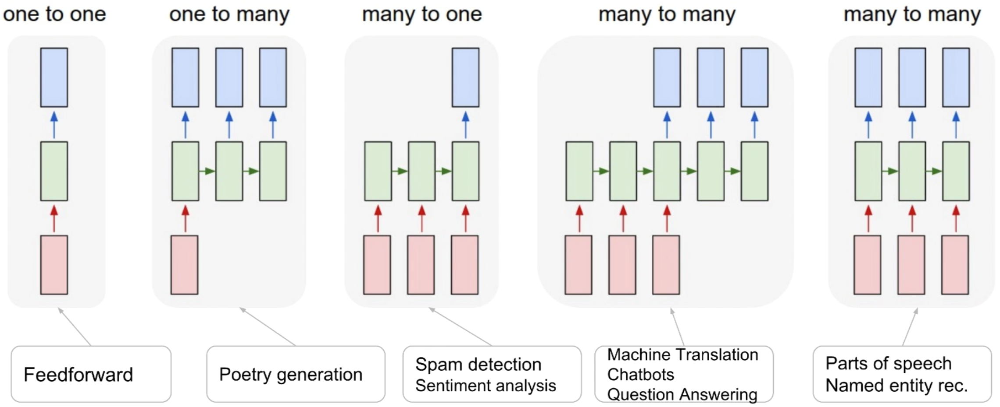

<br>

## Bidirectional RNN
**Why do we need Bidirectional RNN?**
- Sometimes, the sequence is too long to remember some key information in the earlier part of the sequence, adding a reverse direction RNN would help fix this problem.

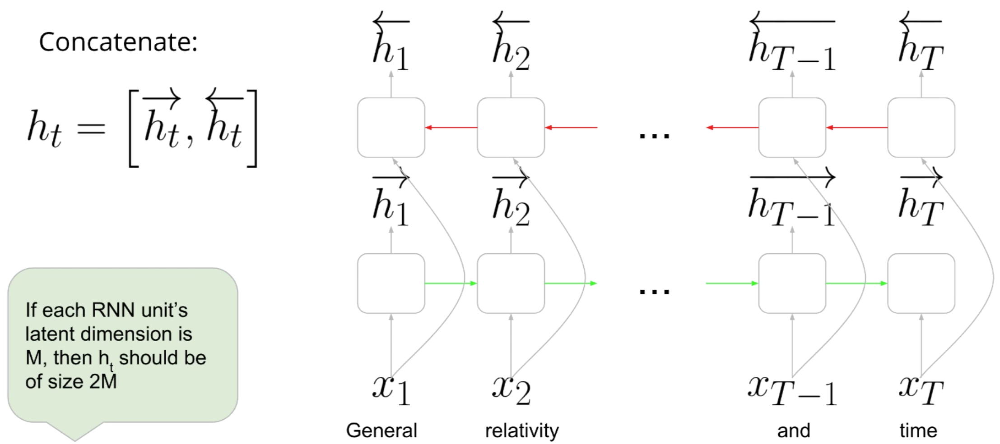

**Exception: Many-to-One**
- It doesn't make sense to take the last(Tth) hidden state h, because the backwards RNN has only seen one worlda!
- $out = [h_T, h^{\prime}_1]$, this is default behavior in Keras if `return_sequences=False`
- Of course, you can take the max over all hidden states: $out = max_t h_t$
  
**When not use Bidrectional RNN?**
- When we want to predict furture, like stock return, temperature
- For some NLP tasks, Bidirectional makes sense because we usually get the entire input at once
<br>

### Image classification with Bidrectional RNN
Architecture
- Let's pretend the image is a sequence of "word vectors" -- a (T, D) matrix
- Pretend height = T, width = D
  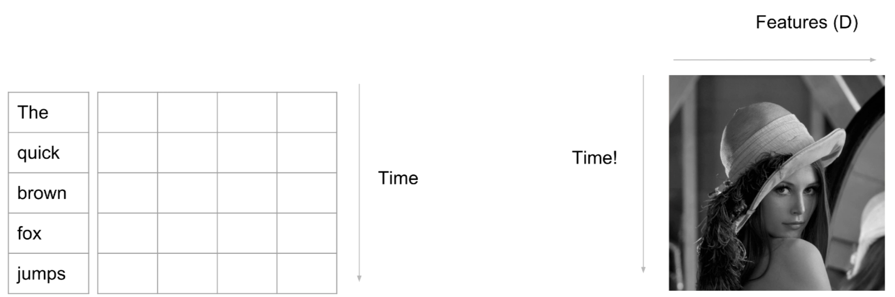
- We can look at the image from 2 perspective:
  - Bidrectional RNN goes from top --> bottom and bottom --> top
- **Rotate the image and run a Bidrectional RNN on both, so we go in all 4 directions**
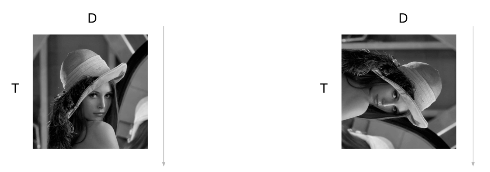
- Given the LSTM latent dimensionality = M, what is the output size?
  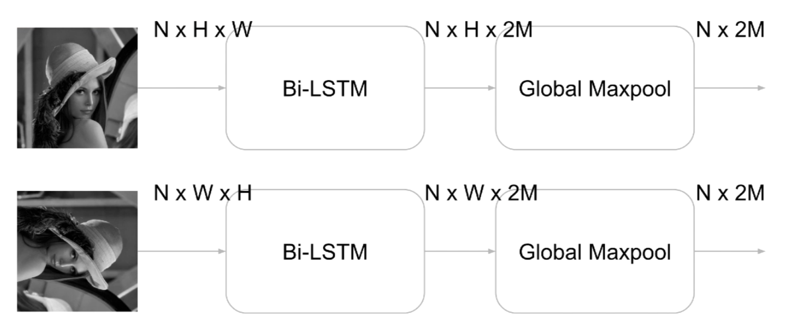
- The complete framework is:
  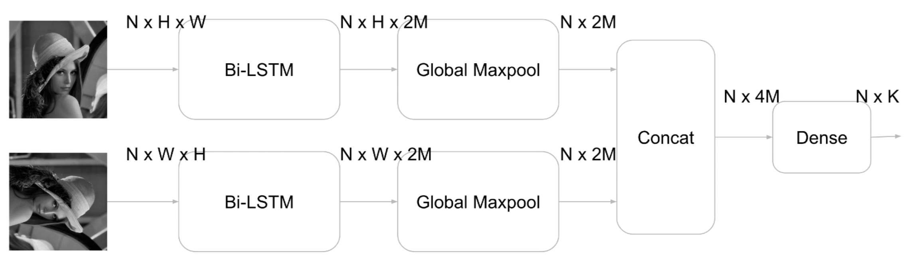

You can refer to the code about how we apply the Bidrectional LSTM on the image dataset `mnist`:

### Bidrectional RNN on mnist example
[Code for Bi_LSTM on mnist](bilstm_mnist.py)

<br>

## Seq2Seq
### Seq2Seq Introduction
- It solves the problem of mapping an input length $T_x$ to an output of length $T_y$, where $T_x != T_y$
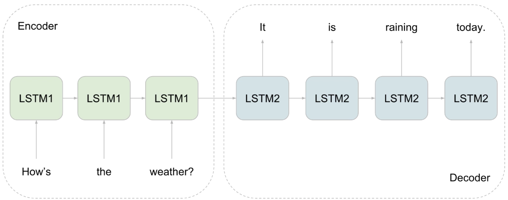

**Encoder**
- No output(probability vector or label, because we are not making predictions
- Only keep the **final hidden state $h_t$** (and $C_t$ if LSTM)
- In Keras, `return_sequence=False`
- The Encoder framework generate **a small and compressed representation** of the input -- a static size M vector
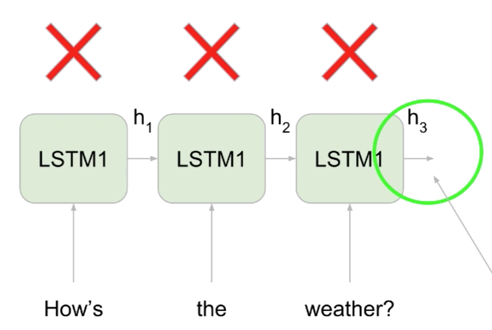

**Decoder**
- New RNN unit with its own weights
- Pass \<start-of-sentence> token into the "x" input
- What should the 2nd (3rd, ...) input be?
  - The previously  generated word:
    - $y_1$ becaomes $x_2$
    - $y_2$ becaomes $x_3$
    - just language modeling, right?
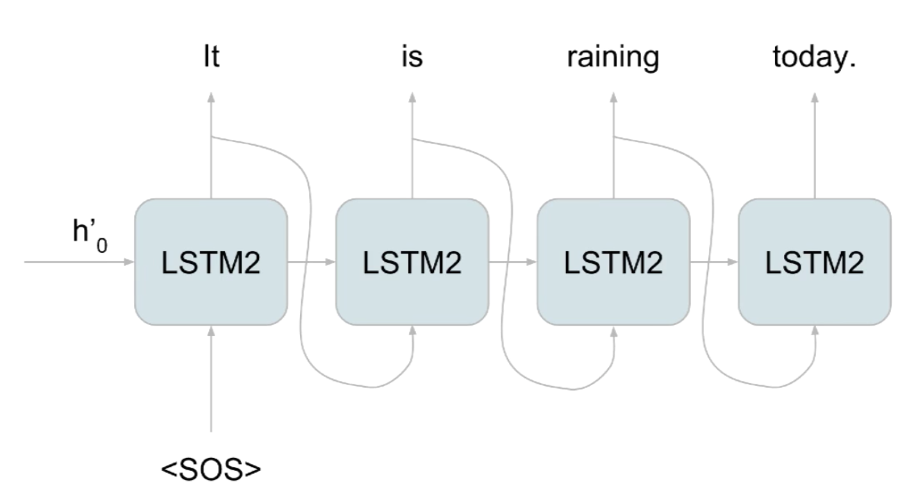

<br>

### Decoding in Detail and Teacher Forcing
Implementation 

<br>

### Translation example using seq2seq:
- Please download the translation dataset first [here](http://www.manythings.org/anki/)
- [Code for seq2seq translation](wseq2seq.py)
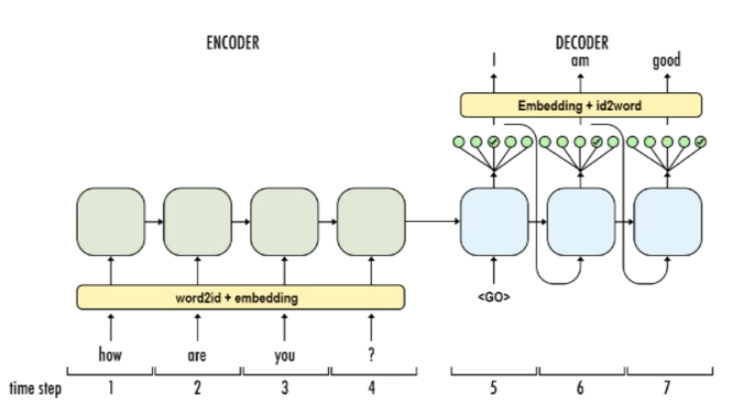

<br>

### Limitations
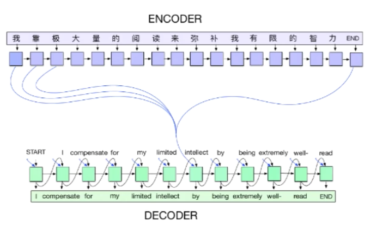
- The entire sequence must fit into one small vector, it might not capture all the information we need when the sequence is very long!
- Previously, we talk about `maxpool` to choose which hidden state would be the most useful
- Can the decoder make use of the information from all the encoder's joddem states as well?
- What happend to Bidirectional RNN?
- In the next section -- **Attention**, you will find the answer

<br>

## Attention
### Attention Introduction
- We know that LSTM and GRU can learn "long-term" dependencies... but how long?
- Doing a `maxpool` over RNN states is like doing a `maxpool` over a CNN features -- it's essentially saying "picking the most important feature"
- By taking the last RNN state, we hope the RNN has both found the relevant and **remembered** it all the way to the end
- **Attention** is just a technique of using "softmax" instead of "hardmax" which gives us a probability distribution over each element for "how much to care"
<br>

### Attention Framework
- Still a seq2seq model, including an encoder and decoder
- `Encoder` is now a Bidirectional LSTM (output shape is $(T_x, 2M)$), and we only care about hidden states and ignore all the cell states
  
**Attention vs. Regular Seq2Seq**
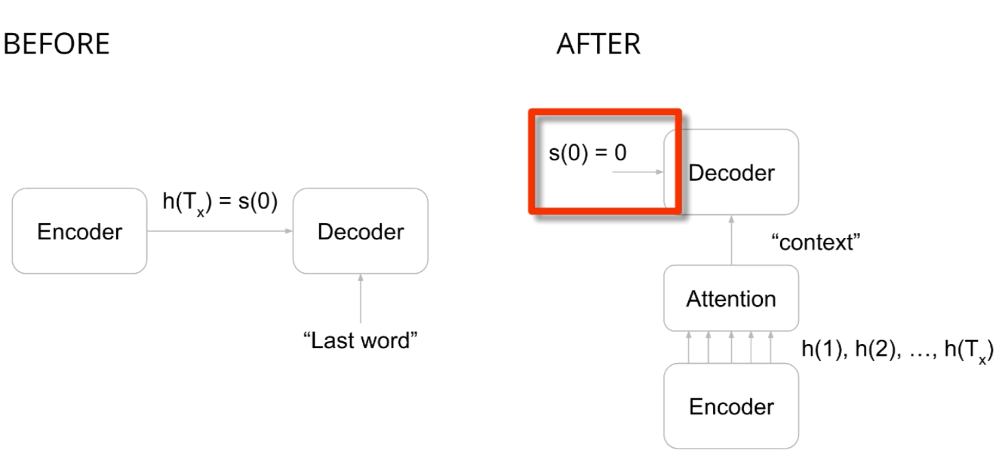
- All the `h()` in the `Encoder` will feed into the Attention calculator to generate the "context" vector to tell us the attention we should give to each `h()`
- There is no need to pass the final hidden state, so `s(0) = 0`
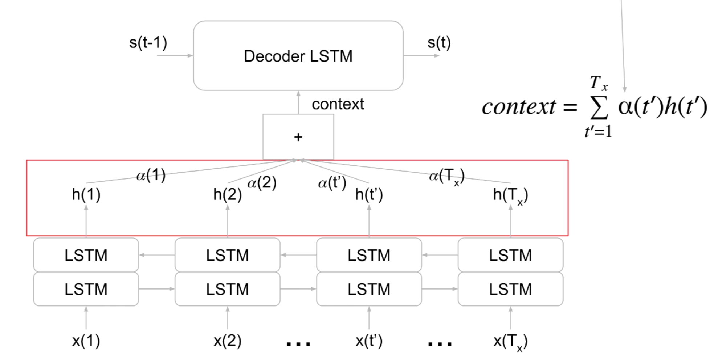
- How do we calculate the **$\alpha$ (attention weights)**? 
  - A neural network, which makes the attention network end to end differentiable so we can the whole things at once
$$\begin{aligned}
  \alpha_{t^{\prime}} =  NeuralNet([s_{t-1}, h_{t^{\prime}}]), t^{\prime} = 1...T_x \\
  context = \sum_{t^{\prime}=1}^{T_x} \alpha(t^{\prime}) h(t^{\prime})
\end{aligned}
$$
- Note we have **2 different ts** -- $t$ and $t^{\prime}$
  - $t$ is for the output sequence ($t = 1...T_{y}$)
  - **$t^{\prime}$** is for the **input** sequence ($t^{\prime} = 1...T_{x}$)
- For **a single step of the output t**, we need to look over **all** of the $h(t^{\prime})$ (we need an $\alpha$ for each one)
- Input vector is **concatenation** of $s(t-1)$ and $h(t^{\prime})$, why?
  - Because the attention depends on not just hidden states $h(t^{\prime})$, but where we are in the output sequence $s(t-1)$
  - If $\alpha$ only depends on h, then they would be the same at every step!
- Example:
  - Input is English, output is Spanish
  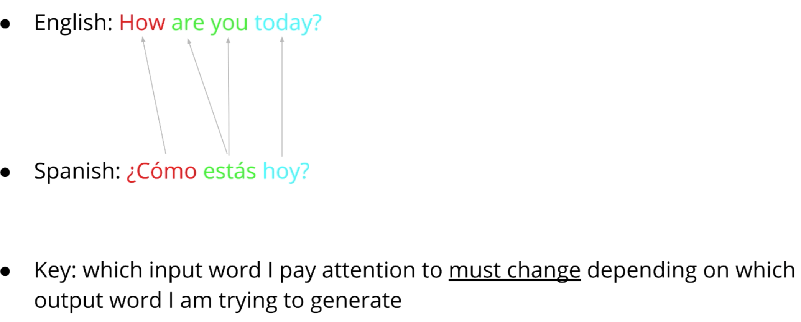
- Pseudo code of calculating attention weights
```python
z = concat[s(t-1), h(t_prime)]
z = tanh(W1z + b1)
z = softmax(W2z + b2)
```
- But wait! We need $\sum_{t^{\prime}=1}^{T_x} \alpha(t^{\prime}) = 1$, the output of the softmax above doen't guarantee this!
- What we should do further is the special "softmax over time":
$$\alpha(t^{\prime}) = \frac{exp(out(t^{\prime}))}{\sum_{\tau=1}^{T_x} exp(out(\tau))}$$
- **$s(t-1)$ will be copied to each $h(t^{\prime})$**
  ```python
  out(1) = NeuralNet([s(t-1), h(1)])
  out(2) = NeuralNet([s(t-1), h(2)])
  out(3) = NeuralNet([s(t-1), h(3)])
  ...
  out(Tx) = NeuralNet([s(t-1), h(Tx)])

  alpha = softmax(out)
  ```
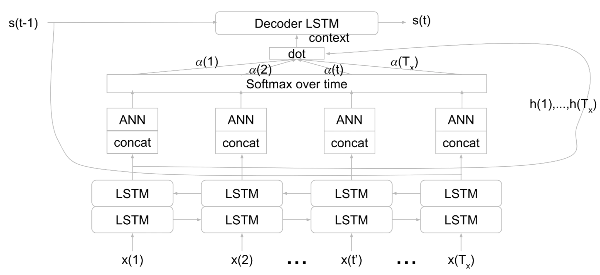

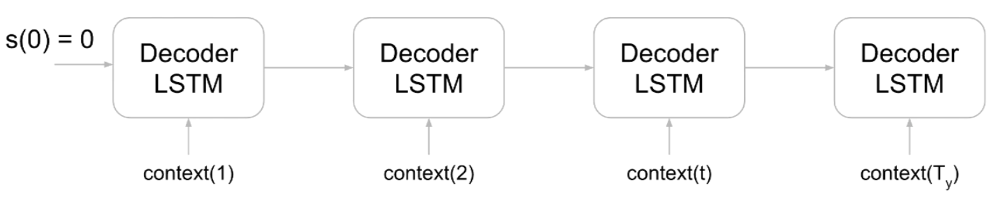

```python
h = encoder(input)

s = 0, c = 0
for t in range(Ty):
  alphas = do_attention(s, h) # alphas is a vector of alpha
  context = dot(alphas, h)
  o, s, c = decoder_lstm(context, initial_states=[s, c]) # s is updated
  output_prediction = dense(o)
```
<br>

**Teacher Forcing**
- What we did for attention is in conflict with teacher forcing, **because now context goes in the bottom instead of the correct last word**
- **Simple solution: just concatenate them together!**
  - Training: `input(t) = [context(t), target(t-1)]`
  - Prediction: `input(t) = [context(t), y(t-1)]`
  - You can even pass this input into a dense layer first to shrink the dimensions

<br>

### Implementation Details
**Keep tracking of Shapes:**
- **Encoder**:
  - Suppose: **Bidirection** LSTM has latent dimension = $M_1$
  - Shape of $h(t^{\prime}) = 2M_1$
  - Shape of sequence of h = $(T_x, 2M_1)$
- **Decoder**:
  - Suppose: LSTM has latent dimension = $M_2$, $s(t-1)$ has shape $M_2$
  $$\alpha_{t^{\prime}} =  NeuralNet([s_{t-1}, h_{t^{\prime}}]), t^{\prime} = 1...T_x$$
  - **After concat**: $[s(t-1), h(t^{\prime})]$ has shape = $M_2 + 2M_1$
  - Full sequence from $1...T_x$ is $(T_X, M_2 + 2M_1)$
  - $\alpha(t^{\prime})$ shape = 1
  - **Sequence of $\alpha$ shape: $(T_x, 1)$**
  - We have problem when applying softmax:
    - Suppose we have a batch size N
    - Our $\alpha$ will actually have the shape: $(N, T_x, 1)$
    - Softmax operates on the **last dimension**, i.e. the "1" dimension, but we want to go over the $T_x$ dimension
    - We need to write our own `softmax_over_time` function
    - **NOTE**: `Keras 2.1.5` allows us to pass in `axis=1` into softmax to fix this problem!
  - Next: we need to get **context**:
  $$\alpha \cdot h = \sum_{t^{\prime}=1}^{T_x} \alpha(t^{\prime})h(t^{\prime})$$
    - $(T_x, 1) (T_x, 2M_1) \rightarrow (1, 2M_1)$, which means for each position in the output, we will have a **context vector** of **length $2M_1$** to tell the Decoder **the attention value for each hidden state in the input sequence**
- There are details we haven't covered yet, which you will see in the code
  - **Teacher forcing**: this is **non-trivial**
    - In regular `seq2seq`, we passed in entire target input all at once, because entire output was calculated in one call
    - When using attention, we have to use a loop over $T_y$ steps (since each **context depends on $s(t-1)$**)
<br>

### Neural Translation example using Attention
Code for Attention: [attention.py](attention.py)

<br>

### Visualizing Attention
- "Outer" loop runs **Ty times(output sequence)**, we need to calculate a new context vector each time, which tells us the importance of each part of input sequence in prediction given different position of output sequence
- "Inner" loop runs Tx times, we need an attention weight for each hidden state h(1), ... h(Tx)
$$\alpha(t, t^{\prime}),\ t=1,...,T_y,\ t^{\prime} = 1,...,T_x$$
- Considering all calculations, we actually have **TxTy attention weights** in total, which is exactly a **matrix**!, just plot it as an **imge**!
  - The following image is an "attention visualization" example of machine translation, you can find some patterns below:
  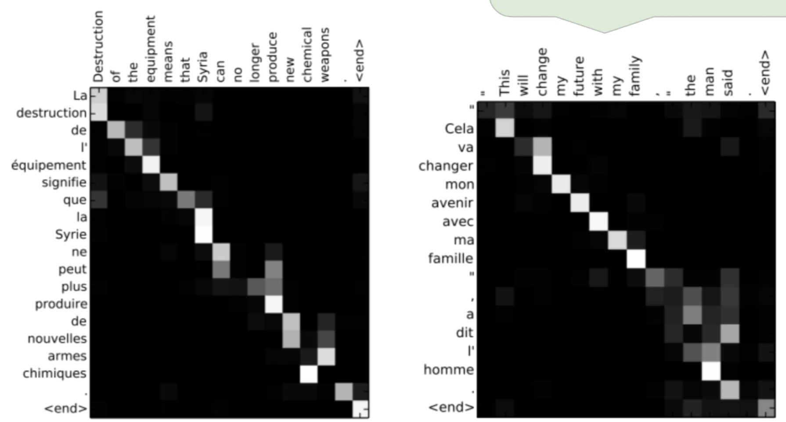

<br>

### Attention Summary
- Limitation of regular seq2seq: entire sequence gets folded into one vector. Attention makes regular seq2seq more powerful
- Solution: consider all hidden states from encoder instead of just the last hidden state, so we need to weight them to determine which is important
  - To get the weights, we can use Neural Networks
  - By using an ANN, the entire model remains **end-to-end differentiable**

<br>

## Memory Networks
### Memory Networks Introduction
- Problem: You are given:
  - A story (containing facts)
  - A question (about the story)
- You need to predict:
  - The answer to the question, which shows that you comprehend the story
  - This is also one type of QA but different from the single input-response type

**bAbI dataset**
- Original research done by Facebook, please see [Towards AI-Complete Question Answering: A Set of Prerequisite Toy Tasks](http://arxiv.org/abs/1502.05698)
- Each sample is not simply an input sentence + output sentence, instead we have:
  - Story (multiple sentences)
  - Question (single sentence)
  - Answer
- Example:
  - **Single supporting fact**
    - Only 1 sentence (fact) in the story is required to answer the question
    - Should remind you of attention: which sentence should i pay attention to?
  - Story:
    - "Mary moved to the bathroom. John went to the hallway."
  - Question:
    - "Where is Mary"
  - Answer:
    - "bathroom"
  - **Two supporting facts**:
    - Tougher task, will require a more complex model
  ```
  7 John went to the hallway
  9 John put down the football
  11 Where is the football? hallway 9 7
  ```

<br>

### Memory Networks Framewotk
In this section, we will deep dive into how Memory Networks work, specifically, we will focus on `Single supporting fact` and `Two supporting facts` tasks
- Memory Network is not very deep, so it's fast in training
- Reacll: a story is a list of sentences, which could be convert into a list of sentence vectors
  
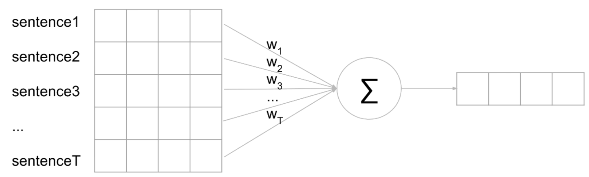

- Should remind you of attention! How to weight each sentence? `Softmax`!
- **Sentence weights**
  - Convert question to a vector (bag of words)
    - note: use its own embedding
  - Dot product **question** with each **sentence**, then softmax
    - $w_i = softmax(s_iq^T)$
    - q: (1, D), S: (T, D), W: (T, 1)
  
  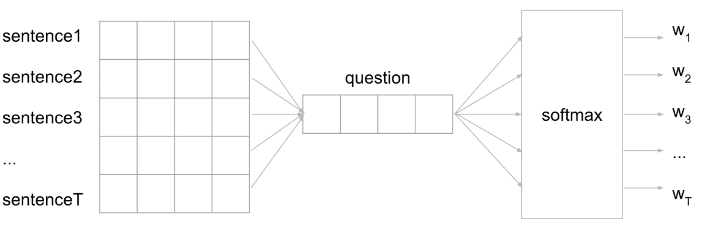
  
- Get the weighted sentence vector ($S_{relevant}$) and add a denser layer to to prediction
  
  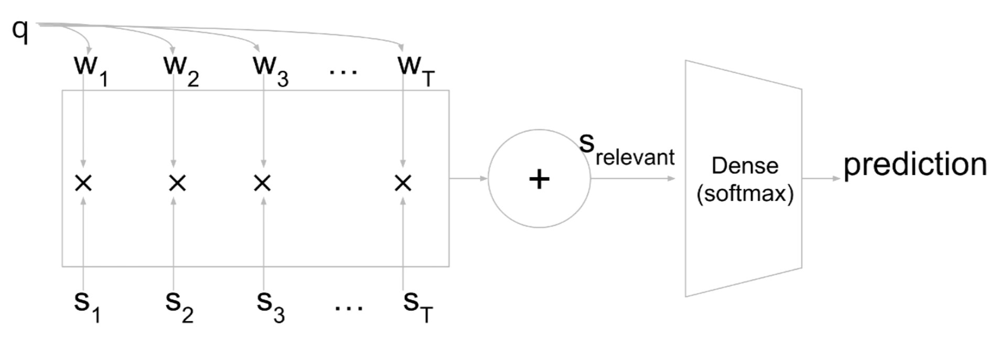

**2 supporting fact model**
- The above model framework won't work now, why?
  - Softmax can only pick 1 thing
  - In addition, order matters!
  ```
  7 John went to the kitchen
  9 John is in the hallway
  11 Where is the John? hallway 9 7
  ```
- How to fix the problem?
  - Simply make two of the same block!
    - one is designed to find the 1st fact
    - another is designed to find the 2nd fact
  - How do we make sure the weights are different? 
    - Pass the output of the **first block (hop)** -- $S_{relevant}$ to the second!
    - looks like recurrent
  
  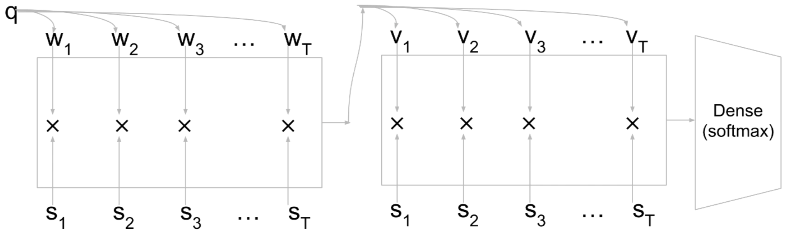

- Similar to attention, you can save the weights of each story line for each question, it will tell us which line the model found most important

<br>

### Memory Networks Code
Code for Memory Networks: [memory_network.py](memory_network.py)

<br>

### Memory Networks Summary

- Is bag-of-words limited? Can we use RNN to get the sentence embedding? Sure!
- Each sentence in story --> RNN --> Single vector
- Question --> RNN --> Single vector
- We can also use Attention
- Use RNN for hops, sort of nested RNN

<br>


## CNN for NLP
In this section, we will mainly focus on how to build a CNN specialized in NLP for some classification tasks (e.g. sentimental analysis)

For details about CNN, please refer to [CNN.md](../Basic-Deep-Learning/CNN/CNN.md)


### CNN Architecture in NLP
- What CNN does is basically search for local features in an image, we can do the same for sentences in text!

Below is the the **CNN architecture** typically used in NLP:
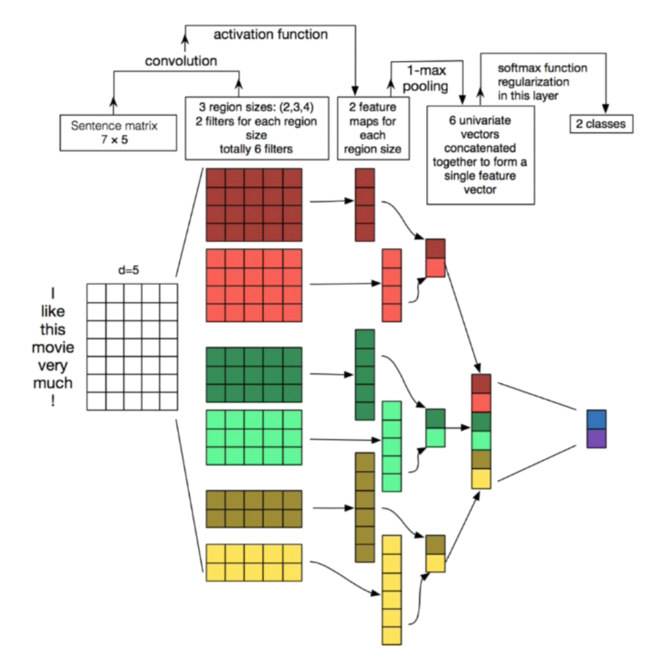
- Each convolution filter has `width = embedding_dim`
- We take `1-max pooling` for each filter, position of a feature in the sentence is less important
- As you can see, we have 3 different size of filters **to capture different scale of correlations between words**

<br>

### Application: Twitter Sentiment Analysis
[Colab Notebook for Twitter Sentiment Analysis using CNN](https://colab.research.google.com/drive/1J8MnRnTqmzT-AI7VpxcTUJD2O7LU7aB6?authuser=2#scrollTo=1ETcf5Wl4Q-7)

<br>

## Transformer
### Intuition
#### General Framework
- In general, transformer would help the model better understand the entire sequence from a more holistic view.
- Just think of this, when you are reading comprehension or translation, you have to take the whole sentence and sometimes the context of the sentence
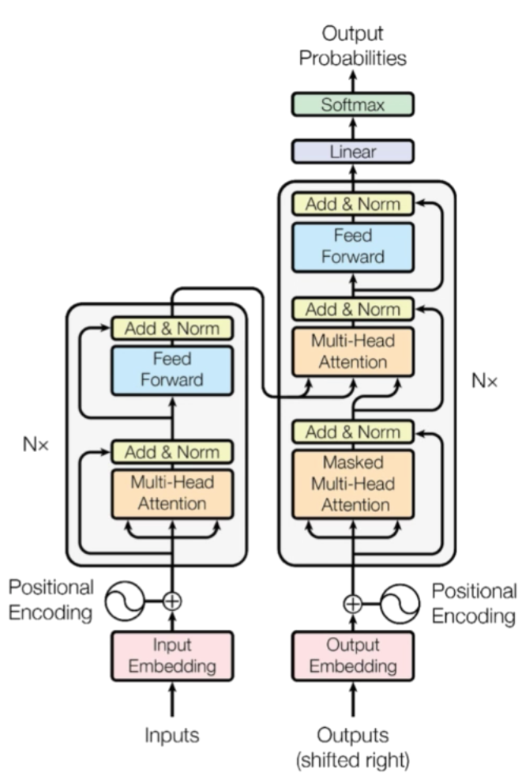

**self-attention**
- **Recompose** the entire sequence by **mixing** all the relationships in the sequence to make a "new representation of the combined sequence" (this process would repeat for several times)

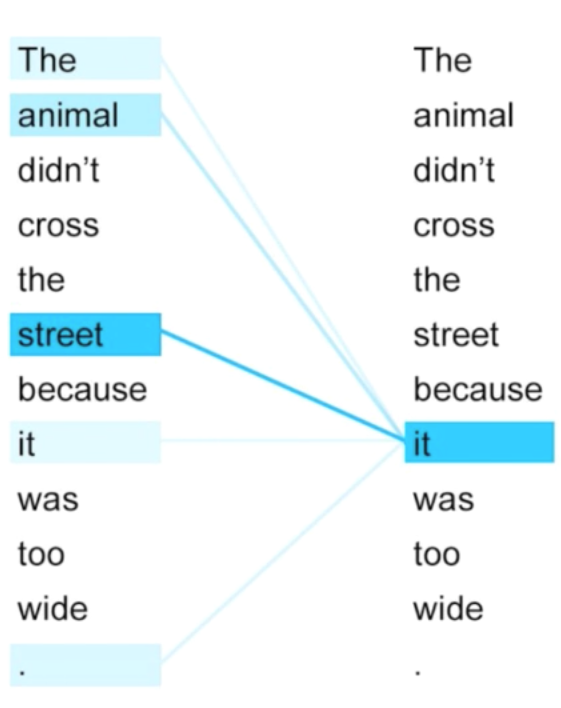
<br>

#### Attention in Transformer
- **Scaled-dot product**:
$$Attention(Q,K,V) = softmax\left(\frac{QK^T}{\sqrt{d_k}}\right)V$$
- Q, K and V are matrices representing sentences/sequences (**after embedding**)
- $QK^T$ example:

- $QK^T$ says how Q is releated to K, word by word. Let's combine $V(=K)$ according to it
- Shape:
  - $Q: (n, q)$
  - $K: (p, q)$
  - $V: (p, q)$
  - $Attention(Q,K,V): (n, q)$, has same shape as Q, but is made with e**lements from V with respect to their correlation with Q**
  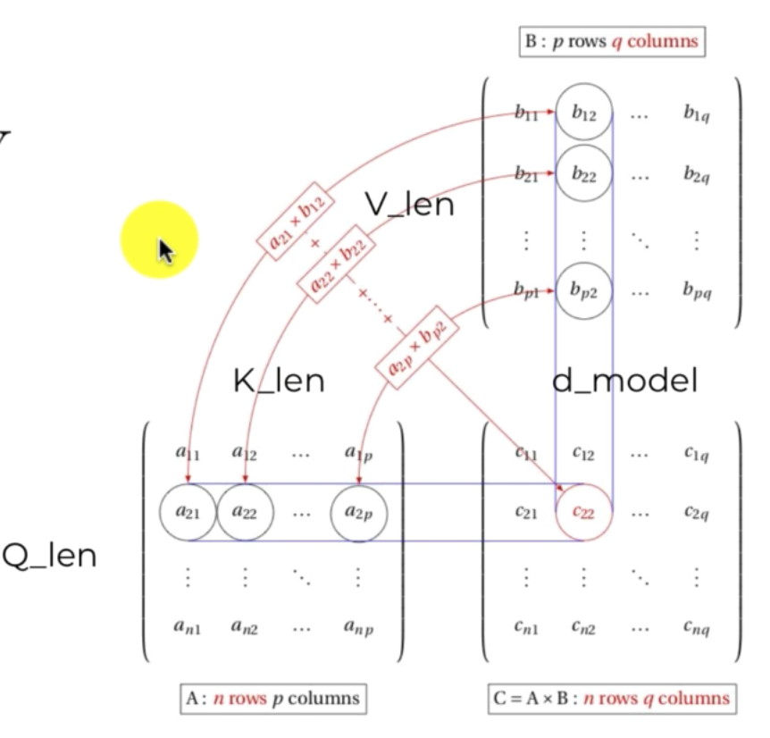
- **Self-attention**: At the beginning of encoding and decoding layers. We **recompose** a sequence to know how each element is related to the others, grabbing **global information** about a sentence/sequence: $Q=K=V$
- **Encoder-Decoder attention**: We have an internal sequence in the `decoder (Q)` and a context from the `encoder (K=V)`. Our new sequences is a combination of information from our context guided by the relation decoder sequence - encoder output: $K=V$
- **Look-ahead mask**: During training, we feed a whole output sentence to the decoder, but to predict word n, we must not look at words after n, so let's change the attention matrix:
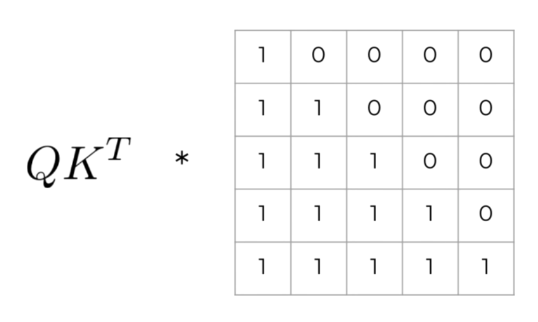
- **Multi-head attention layer**: 
  - **Linear projections**: apply the attention mechanism to multiple learned subspaces. 
  - For example, in the diagram below, if we have `dim=120`, we have **3 subspaces**, then each subspace has `dim=40`
  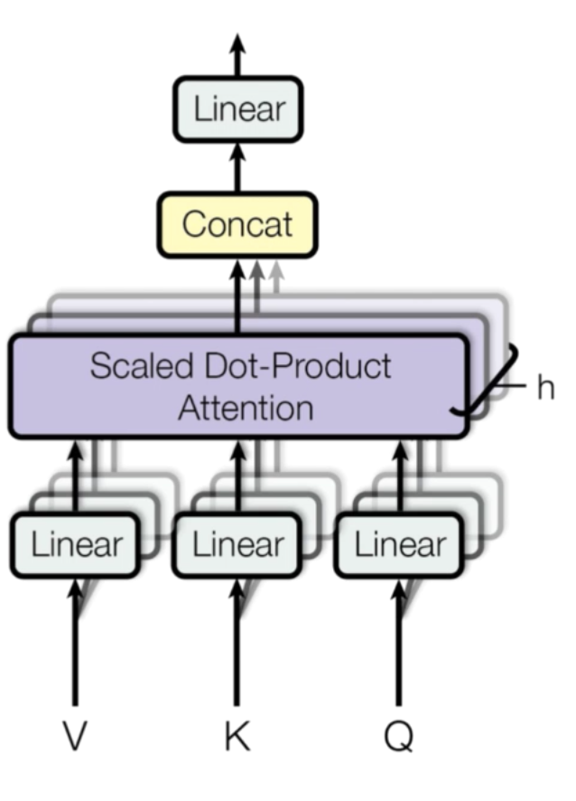
  - Why? `"Multi-head attention allows the model to jointly attend to information from different representation subspaces at different positions. With a single attention head, averaging inhibits this"`
  - Mathmatially: one big linear function, and then a splitting allows each subspace to compose with the full original vector!
<br>

#### Positional encoding  
- Why do we need positional encoding? 
  - Model has no clue about the order of the sequence.
$$\begin{aligned}
  PE(pos, 2i) &= sin(pos / 10000^{2i/dmodel}) \\
  PE(pos, 2i+1) &= cos(pos / 10000^{2i/dmodel})
\end{aligned}
$$
  - `pos`: index of a word in a sequence (0 ~ n-1)
  - `i`: one of the dimensions of the embedding (0 ~ dmodel - 1)
  
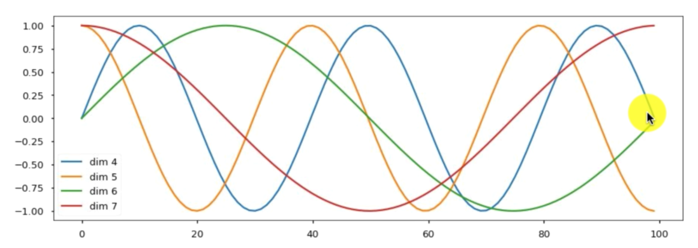

#### Other details
**Feed forward layers**: feed forward layer at the end of each `encoding/decoding` sub layer:
- composed of **2 linear transformation** -- 2 dense layers with activation function = `relu`
- **applied to each position** separately and identically
- different for each sub layer
$$FFN(x) = ReLu(xW_1 + b_1)W_2 + b_2 = max(0, xW_1 + b_1)W_2 + b_2$$

**Residual connections**: `Add & Norm`
- This would help the model not forget about the information we previously had in each position.
- Also in deep learning, it helps learning during back propagation.

**Dropout**: Shut down some neurons during training to prevent overfitting
- "We apply `dropout` to the output of each sub-layer, before it is added to the sub-layer input and normalized. In addition, we apply `dropout` to the sums of the `embeddings` and the `positional encoding` in both the `encoder` and `decoder`"

**Last linear**: Output of the decoder goes through a dense layer with `vocab_size` units and a `softmax`, to get probabilities for each word


Last but not least, if you want to see the original attention paper, here is the link: [Attention is all you need](https://papers.nips.cc/paper/7181-attention-is-all-you-need.pdf)

<br>


### Application
**Things to figure out**:
- How to use `tf.data.Dataset`
- Understand why we need mask and **how we implement** `padding_mask` and `look_ahead_mask` in the code
- Pay attention to the training part
  - How to customize `learning_rate`
  - How to use `tf.GradientTape()`


[Colab Notebook for Machine Translation using Transformer](https://colab.research.google.com/drive/186ScOqTWRcFZQ5ZucG2rTkKnTaP8mXFX?authuser=2#scrollTo=D7JItpmSq3O2)

<br>


<br>
<br>
<br>
<br>
<br>
