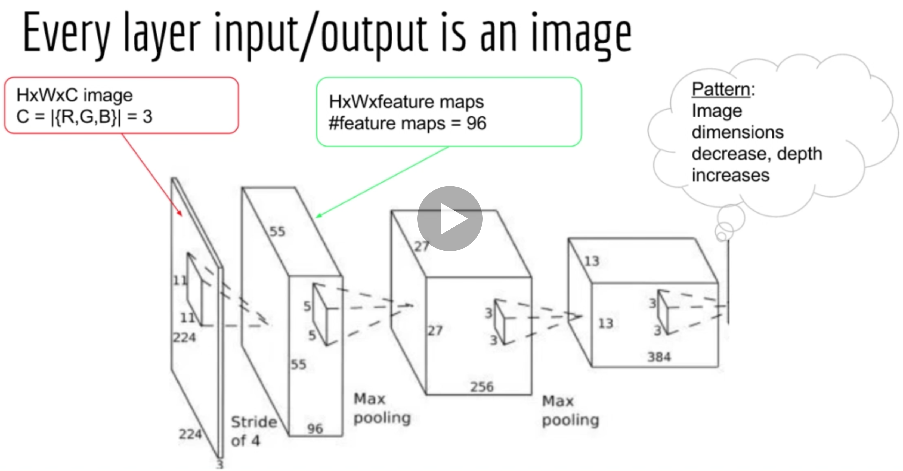
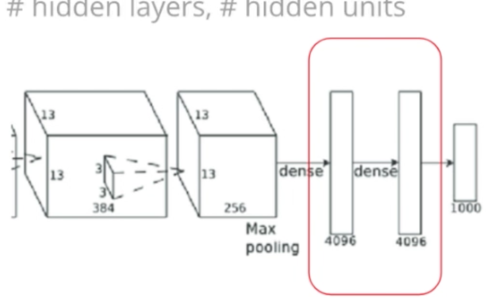

<!-- TOC -->

- [Description](#description)
- [Convolution](#convolution)
	- [Convolution from Statistics Perspective](#convolution-from-statistics-perspective)
- [Convolutional Neural Network Description](#convolutional-neural-network-description)
	- [Architecture of CNN](#architecture-of-cnn)
		- [Technicalities](#technicalities)
		- [Convolution over 3D Images](#convolution-over-3d-images)
	- [Tracking shapes in CNN](#tracking-shapes-in-cnn)
		- [Convolution Modes](#convolution-modes)
	- [Receptive Fields](#receptive-fields)
	- [Convolution and Pooling Gradient](#convolution-and-pooling-gradient)
		- [Convolution Gradient](#convolution-gradient)
		- [Pooling Gradient](#pooling-gradient)
	- [LeNet](#lenet)
- [Practical Tips](#practical-tips)
	- [Image Processing Tips](#image-processing-tips)
	- [Advanced CNN Design](#advanced-cnn-design)

<!-- /TOC -->

## Description
This folder is mainly for holding notebooks and .py files for CNN.

The content below is simple introduction of some key components of CNN and pratical tips.

Get the data: http://ufldl.stanford.edu/housenumbers/

## Convolution
- I = Input image
- K = Kernel or filter
- * = Convollution operator

**What is Convolution?**

Continuous:

$$x(t) * w(t) = \int x(\tau)w(t - \tau)d\tau = \int w(\tau)x(t - \tau)d\tau$$

Discrete:

$$x(n) * w(n) = \sum x(m)w(n-m) = \sum w(m)x(n-m)$$

You can slide the filter(`w`) across the signal(`x`), or slide the signal across the filter, it's the same thing

**Convolution in 2D:**

$$x[n, m] * w[n,m] = \sum x[n-i, m-j]w[i,j]$$

### Convolution from Statistics Perspective

**Cross-correltaion**

- Don't confuse this with the correlation efficient (r), which is just a number
	- E.g. Y = 2X+1 --> r = 1, since Y can be predicted precisely from X
	- E.g. Y = -2X+1 --> r = -1, since Y decreases as X increases
- The idea behind cross-correlation function is **similar**: it tells us how predictable one time series is from another, **but the result is another function**, not just a number
- Cross-correlation function applies to time series (or any sequence, the independent variable need not to be time, for example in an image, the independent variable is horizontal/vertical distance)

**Autocorrelation**

$$
\begin{aligned}
R(\tau) &= \frac{E[((X_t - \mu))(X_{t+\tau} - \mu)]}{\sigma^2} \\
R_{xx}(\tau) &= \int_{-\infty}^{\infty} x(\tau)w(t + \tau)d\tau
\end{aligned}
$$

$$\begin{aligned}
Cross-correlation: x(t) * w(t) &= \int_{-\infty}^{\infty} x(\tau)w(t + \tau)d\tau \\
Convolution: x(t) * w(t) &= \int_{-\infty}^{\infty} x(\tau)w(t - \tau)d\tau
\end{aligned}
$$

- Cross-correlation gives us a **spike** anywhere the two signals are correlated given a certain **displacement**
- Cross-correlation is just the convolution but flipping one of the signals first
- The filter(`w`) represents what pattern we are looking for
- After doing convolution with an image/signal, we'll **see spikes where the pattern occurred**, spikes tell us where in the image the pattern was found.

 

## Convolutional Neural Network Description

**Why Convolution for images?**

- Translational invariance: convolution filter could help us find the pattern no matter where it is on the image 
- Weights sharing: less parameters, better generalization
 
 

### Architecture of CNN
- Convolution
- Downsampling: max_pool
- Fully-connected MLP

#### Technicalities
- 4D tensor input: N * 3 colors * width * height
- 4D convolution filter: #feature maps * 3 colors * width * height
- Filter size << Image size

#### Convolution over 3D Images
3D signal: Theano: (C * W * H), **Tensorflow: (H * W * C)**

- Input image: H * W * C1(3 for colored image, 1 for BW image)
- Filter: C1 * K * K * C2(#different filters)
- Output image: H * W * C2

**Takeaways:**

- In real world, we may have 100 or 1000 feature maps, #feature maps is a hyper-parameter
- We optimize the filters using barkprop/gradient descent on the loss function
- We don't manually decide what features filters should find, we just leave it to the computer to find it out
- Convolution layers just act as the feature extractor, we simply use the extracted features as the input of the fully connected layer(s), which is exactly a simple feed forward NN.

 

### Tracking shapes in CNN
So far, we know the basic architecture of CNN is:

- Conv --> Poll --> Conv --> Pool --> (Flatten) --> Fully-Connected(Dense) --> 
Fully-Connected(Dense)

#### Convolution Modes
**`Valid` vs `Same` vs `Full`**

- `Valid mode`: filter never goes outside the input
- If:
	- Input length = N
	- Filter length = K
- Then:
	- **Output length = N-K+1**
  

- `Full mode`: filter allowed to go outside the input, far enough so that there is at least still 1 overlapping element
- If:
	- Input length = N
	- Filter length = K
- Then:
	- **Output length = N+K-1**
  

- `Same mode`: padding is set such that input length == output length
- If:
	- Input length = N = 5
	- Filter length = K = 3
- Then:
	- **Padding length = p = 1**
	- Note: also ccalled "half padding" in Theano since $P = \left \lfloor{(k/2)}\right \rfloor$ 

- If:
	- Input length = N = 7
	- Filter length = K = 5
- Then:
	- **Padding length = p = 2**

**How to choose filter sizes?**

- Image shrinks due to pooling, **filters generally stay the same**
- Number of feature maps increases

**What has a CNN learned?**

put some images here to explain

- Images shrinks as the layer increases, while shape of filter are often the same. So the filters will generally find larger and larger patterns as the layer increases!
- The feature maps of deeper layer are just the weighted linear combination of small patterns from previous layers

### Receptive Fields

  

### Convolution and Pooling Gradient

#### Convolution Gradient

#### Pooling Gradient
- Average pooling is easy, we know how to take the derivative inside a summation already
- What about max pooling?
	- if it influences an output, it should be updated
	- a weight should be updated **by the error singal at any nodes it affects**

### LeNet
We will review the LeNet architecture in-depth, it's basically just 2 simple steps:

- Conv + Pooling(ConvPool)
- Feedforward nn layers

3D signal: Theano: (C * W * H), **Tensorflow: (H * W * C)**

4D tensor: (#feature maps in, #feature maps out, filter Width, filter Height)

**Think about it: How many numbers do we need to specify the shape of a convolution filter?**

Need to specify 3 numbers: #feature maps out, filter width, filter height

 

## Practical Tips
### Image Processing Tips
**More Invariance**

- Translations
- Rotations
- Color invariance: A red 9 should be the same as a blue 9
- Size invariance: A small 9 should be the same as a big 9

 

### Advanced CNN Design
Here we are talking about **image classification** problems:

- (1) Convolutional layers come first, put fully connected layers in the end
- (2) For convolutional layers, image dimensions decrease, while depth(`#color channel` or `#feature maps`) increases.

- (3) For fully connected layers, typically either all hidden layers are the same size or decrease 
	- same size is more common - research has found it doesn't overfit)
	- same number of hidden units per layer also allows us less choises: we only have to decide 2 things: #hidden layers, #hidden units

VGG

AlexNet

GoogLeNet

