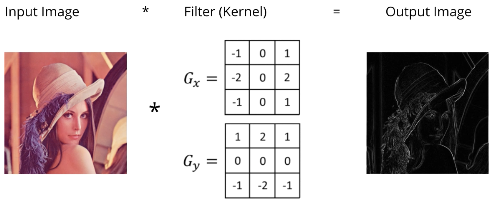
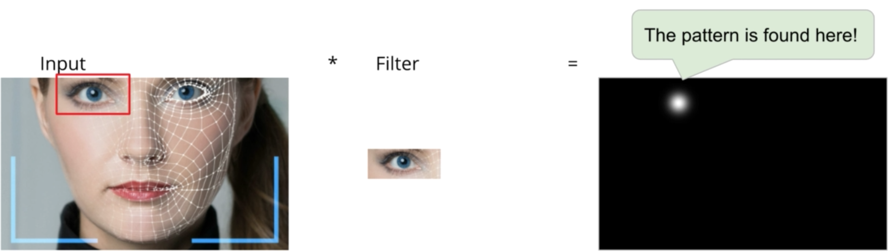
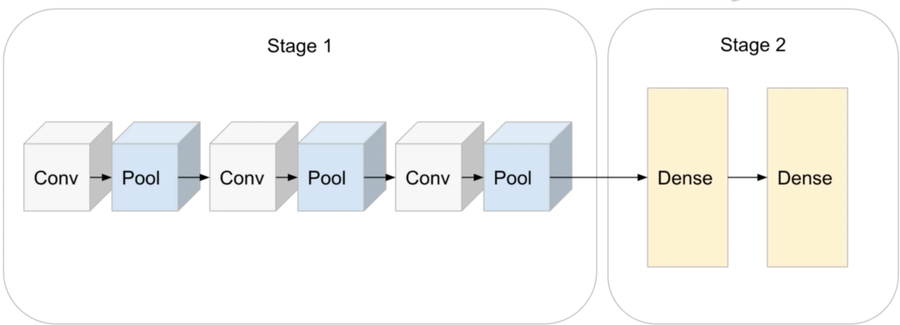

<!-- TOC -->

- [Description](#description)
- [Convolution](#convolution)
	- [Convolution from Statistics Perspective](#convolution-from-statistics-perspective)
- [Convolutional Neural Network Description](#convolutional-neural-network-description)
	- [CNN Architecture](#cnn-architecture)
		- [Max and Average Pooling](#max-and-average-pooling)
		- [Technicalities](#technicalities)
		- [Convolution over 3D Images](#convolution-over-3d-images)
	- [Tracking shapes in CNN](#tracking-shapes-in-cnn)
		- [Convolution Modes](#convolution-modes)
	- [Receptive Fields](#receptive-fields)
	- [Convolution and Pooling Gradient](#convolution-and-pooling-gradient)
		- [Convolution Gradient](#convolution-gradient)
		- [Pooling Gradient](#pooling-gradient)
	- [LeNet](#lenet)
- [Practical Tips](#practical-tips)
	- [Data Augmentation](#data-augmentation)
	- [Image Processing Tips](#image-processing-tips)
	- [Advanced CNN Design](#advanced-cnn-design)

<!-- /TOC -->

## Description
This folder is mainly for holding notebooks and .py files for CNN.

The content below is simple introduction of some key components of CNN and pratical tips.

Get the data: http://ufldl.stanford.edu/housenumbers/

## Convolution
- I = Input image
- K = Kernel or filter
- * = Convollution operator

**What is Convolution?**

A "no math" look at convolution  
- Blurring
  
- Edge detection
  

**Convolution = Image Modifier**: it's just a feature transformation on the image

Continuous:

$$x(t) * w(t) = \int x(\tau)w(t - \tau)d\tau = \int w(\tau)x(t - \tau)d\tau$$

Discrete:

$$x(n) * w(n) = \sum x(m)w(n-m) = \sum w(m)x(n-m)$$  

You can slide the filter(`w`) across the signal(`x`), or slide the signal across the filter, it's the same thing

**Convolution in 2D:**

$$x[n, m] * w[n,m] = \sum x[n-i, m-j]w[i,j]$$
$$(A * w)_{ij} = \sum_{i^{\prime}=0}^{M-1}\sum_{j^{\prime}=0}^{N-1} A(i+i^{\prime}, j+j^{\prime})w(i^{\prime}, j^{\prime})$$

  
  
  

 

### Convolution from Statistics Perspective

**Cross-correltaion**

- Don't confuse this with the correlation efficient (r), which is just a number
	- E.g. Y = 2X+1 --> r = 1, since Y can be predicted precisely from X
	- E.g. Y = -2X+1 --> r = -1, since Y decreases as X increases
- The idea behind cross-correlation function is **similar**: it tells us how predictable one time series is from another, **but the result is another function**, not just a number
- Cross-correlation function applies to time series (or any sequence, the independent variable need not to be time, for example in an image, the independent variable is horizontal/vertical distance)

**Autocorrelation**

$$
\begin{aligned}
R(\tau) &= \frac{E[((X_t - \mu))(X_{t+\tau} - \mu)]}{\sigma^2} \\
R_{xx}(\tau) &= \int_{-\infty}^{\infty} x(\tau)w(t + \tau)d\tau
\end{aligned}
$$

$$\begin{aligned}
Cross-correlation: x(t) * w(t) &= \int_{-\infty}^{\infty} x(\tau)w(t + \tau)d\tau \\
Convolution: x(t) * w(t) &= \int_{-\infty}^{\infty} x(\tau)w(t - \tau)d\tau
\end{aligned}
$$

- Cross-correlation gives us a **spike** anywhere the two signals are correlated given a certain **displacement**
- Cross-correlation is just the convolution but flipping one of the signals first
- The filter(`w`) represents what pattern we are looking for
- After doing convolution with an image/signal, we'll **see spikes where the pattern occurred**, spikes tell us where in the image the pattern was found.

 

**Perspective of Pattern Finding/Detection**  
How to measure similarity in ML problem?  
- **dot product:(similar to convolution)**
  $$a^Tb = \sum_{i=1}^N a_ib_i = |a||b|cos(\theta_{ab})$$
- cosine similarity
  $$cos(\theta_{ab}) = \frac{a \cdot b}{|a||b|} = \frac{\sum_{i=1}^N a_ib_i}{\sqrt{\sum_{i=1}^N a_i^2} \sqrt{\sum_{i=1}^N b_i^2}}$$
- pearson correlation
  $$pearson\ correlation = \frac{\sum_{i=1}^N (a_i-\bar a) (b_i - \bar b)}{\sqrt{\sum_{i=1}^N (a_i-\bar a)^2} \sqrt{\sum_{i=1}^N (b_i-\bar b)^2}}$$
- The above three measures are basically the same thing, they just measure the similarity in different scale

As you can see:  
- Filtering and convolution are not abstract concepts!
- "Filter" actually make sense, it filters out everything not releated(similar) to the pattern contained in the filter

**Perspective of Weight Sharing/Matrix Mulplication**  
Let's see 1D convolution first:
- Input image: $a = [a_1, a_2, a_3, a_4]$
- Filter: $w=[w_1, w_2]$
- Conv results: $b = a * w = [a_1w_1 + a_2w_2, a_2w_1 + a_3w_2, a_3w_1, a_4w_2]$

2D Convolution:  

- By repeating the same filter(w1,w2) again and again, we can do convolution by matrix mulplication
- So why don't we use matrix mulplication instead of convolution?
  - The matrix takes up too much space, its shape is (3,4) compared with the original filter: (2,)
- This repeating (w1,w2) is also called `weight sharing`, actually, there are some advantages:
  - Save space, or reduce the number of params, which prevent overfitting
  - Transalational invariance, remember, convolution is a pattern filter, we want a filter to **detect patterns regardless of the position of the pattern in the image**!

**Conv layer VS Dense layer**
- Recall: convolution is like `shared-weight` version of matrix multiplication (e.g. in Dense layer)
- In Dense layer, we also have a `bias term` and `activation function`, for Conv layer, it's the same thing!
  - Conv layer: $\sigma(W * x + b)$
  - Dense layer: $\sigma(W^Tx + b)$
- **NOTICE**:
  - In a Dense layer, if $W^Tx$ is a vector of size M, b is also a vector of size M 
  - In a Conv layer, b does not have the same shape as $W * x$ (a 3D image), b is actually a vector of size C2, how?
    - Using the numpy broadcasting: if W * x has the shape of (H,W,C2), then b is a vector of C2, meaning **one scalar per feature map**!

**How much do we save using CNN compared to ANN?**  
- CNN：
  - Input image: 32x32x3
  - Filter:3x5x5x64
  - Output: 28*28*64 (28=32-5+1)
  - #params (ignoring 64 bias terms): 3x5x5x64 = 4800
- ANN:
  - Flattened input image: 32x32x3 = 3072
  - Flattened output: 28*28*64 = 50176
  - Weight matrix(#params, ignoring 50176 bias terms): 3072 * 50176 ~ 154 MILLION!!! This is 32,000 times more params compared to CNN

 

## Convolutional Neural Network Description
**Why Convolution for images?**

- Translational invariance: convolution filter could help us find the pattern no matter where it is on the image 
- Weights sharing: less parameters, better generalization
  
 

### CNN Architecture
- Convolution
- Downsampling: max_pool
- Fully-connected MLP

#### Max and Average Pooling
**Typical CNN**

**Max pooling**

**Average pooling**

**Why use pooling?**  
- Practical: we have less data to process if we shrink the image!
- Translational invariance: we don't care where  in the image the feature/pattern occurred, we only care if it occurs!
- Recall: convolution is a "pattern finder", and max pooling could use highest number to find the best matching location

**Why convolution followed by pooling?**  
- CNN is able to learn features **hierarchically**
  
- Key point: after each "conv-pool", images shrink, but filter sizes generally stay the same
  - Assume `same mode` convolution with pool size=2
  - The portion of the image that the filter covers increases as the filter size stay the same while image size shrinks!
  

**Do we lose information?**  
- Yes, we lose information as we shrink the image size
- We lose spatial infomation, but we don't care where the feature was found, we care whether we found some useful features!
- On the other hand, generally, #feature maps increases at each layer. Hence, **we actually gain information in terms of number of different features found**

**Global Max Pooling**  
- What if we have different-sized images, can CNN handle this situation? Yes!
  
- Takes the max over each feature map, then we will always get an output of 1x1xC(or just a vector of size C) **regardless of H and W**
- Also, you can do global average pooling
- **Exception**: if the image size is too small, and you add too many conv layers, you will get an error!
 

#### Technicalities
- 4D tensor input: N * 3 colors * width * height
- 4D convolution filter: #feature maps * 3 colors * width * height
- **Filter size << Image size**

#### Convolution over 3D Images
3D signal: Theano: (C * W * H), **Tensorflow: (H * W * C)**

- Input image: H * W * C1(3 for colored image, 1 for BW image)
- Filter: C1 * K * K * C2(#different filters)
- Output image: H * W * C2

**Takeaways:**

- In real world, we may have 100 or 1000 feature maps, #feature maps is a hyper-parameter
- We optimize the filters using barkprop/gradient descent on the loss function
- We don't manually decide what features filters should find, we just leave it to the computer to find it out
- Convolution layers just act as the feature extractor, we simply use the extracted features as the input of the fully connected layer(s), which is exactly a simple feed forward NN.

 

### Tracking shapes in CNN
So far, we know the basic architecture of CNN is:

- Conv --> Poll --> Conv --> Pool --> (Flatten) --> Fully-Connected(Dense) --> 
Fully-Connected(Dense)

#### Convolution Modes
**`Valid` vs `Same` vs `Full`**

- `Valid mode`: filter never goes outside the input
- If:
	- Input length = N
	- Filter length = K
- Then:
	- **Output length = N-K+1**
  

- `Full mode`: filter allowed to go outside the input, far enough so that there is at least still 1 overlapping element
- If:
	- Input length = N
	- Filter length = K
- Then:
	- **Output length = N+K-1**
  

- `Same mode`: padding is set such that input length == output length
- If:
	- Input length = N = 5
	- Filter length = K = 3
- Then:
	- **Padding length = p = 1**
	- Note: also ccalled "half padding" in Theano since $P = \left \lfloor{(k/2)}\right \rfloor$ 

- If:
	- Input length = N = 7
	- Filter length = K = 5
- Then:
	- **Padding length = p = 2**

**How to choose filter sizes?**

- Image shrinks due to pooling, **filters generally stay the same**
- Number of feature maps increases

**What has a CNN learned?**

put some images here to explain

- Images shrinks as the layer increases, while shape of filter are often the same. So the filters will generally find larger and larger patterns as the layer increases!
- The feature maps of deeper layer are just the weighted linear combination of small patterns from previous layers

### Receptive Fields
 
 

### Convolution and Pooling Gradient

#### Convolution Gradient

#### Pooling Gradient
- Average pooling is easy, we know how to take the derivative inside a summation already
- What about max pooling?
	- if it influences an output, it should be updated
	- a weight should be updated **by the error singal at any nodes it affects**

### LeNet
We will review the LeNet architecture in-depth, it's basically just 2 simple steps:

- Conv + Pooling(ConvPool)
- Feedforward nn layers

3D signal: Theano: (C * W * H), **Tensorflow: (H * W * C)**

4D tensor: (#feature maps in, #feature maps out, filter Width, filter Height)

**Think about it: How many numbers do we need to specify the shape of a convolution filter?**

Need to specify 3 numbers: #feature maps out, filter width, filter height

 

## Practical Tips
### Data Augmentation

 

### Image Processing Tips
**More Invariance**

- Translations
- Rotations
- Color invariance: A red 9 should be the same as a blue 9
- Size invariance: A small 9 should be the same as a big 9

 

### Advanced CNN Design
Here we are talking about **image classification** problems:

- (1) Convolutional layers come first, put fully connected layers in the end
- (2) For convolutional layers, image dimensions decrease, while depth(`#color channel` or `#feature maps`) increases.

- (3) For fully connected layers, typically either all hidden layers are the same size or decrease 
	- same size is more common - research has found it doesn't overfit)
	- same number of hidden units per layer also allows us less choises: we only have to decide 2 things: #hidden layers, #hidden units

VGG

AlexNet

GoogLeNet

