<!-- TOC -->

- [Description](#description)
- [Simple Recurrent Unit](#simple-recurrent-unit)
	- [Backpropagation Through Time](#backpropagation-through-time)
- [RNN for NLP](#rnn-for-nlp)
	- [Word Embeddings and RNN](#word-embeddings-and-rnn)
	- [Generating Poetry](#generating-poetry)
- [Advanced RNN Unites](#advanced-rnn-unites)
	- [Rated RNN](#rated-rnn)
	- [GRU](#gru)
		- [GRU Architecture](#gru-architecture)
	- [LSTM](#lstm)
	- [Learning from Wikipedia Data](#learning-from-wikipedia-data)

<!-- /TOC -->
 
## Description
This folder is mainly for holding notebooks and .py files for RNN.

The content below is simple introduction of some key components of RNN and pratical tips.

We will start talking from **Simple Recurrent Unit**, also known as the **Elman unit**. After that, we will revisit the **XOR** problem, but we’re going to extend it so that it becomes the **parity** problem - you’ll see that regular feedforward neural networks will have trouble solving this problem **but recurrent networks will work because the key is to treat the input as a sequence.**

Later, we will talk about some applications of recurrent neural networks in NLP, such as **language modeling, word embeddings**(how recurrent neural networks can also be used for creating word vectors)

After that, we’ll look at the very popular **LSTM(long short-term memory unit)**, and the more modern and efficient **GRU(gated recurrent unit)**, which has been proven to yield comparable performance. We’ll also apply these to some more practical problems, such as learning a language model from Wikipedia data and visualizing the word embeddings we get as a result.

 

## Simple Recurrent Unit

- Usually, we are dealing with data X in shape of (N, D) matrix
- Suppose now we are dealing with a sequence of data, each sequence is of length T
- All sequences: (N,T,D)
- What if sequences are not equal length? (sound/music/sentences)
	- Store in a list, the nth element is T(n) * D
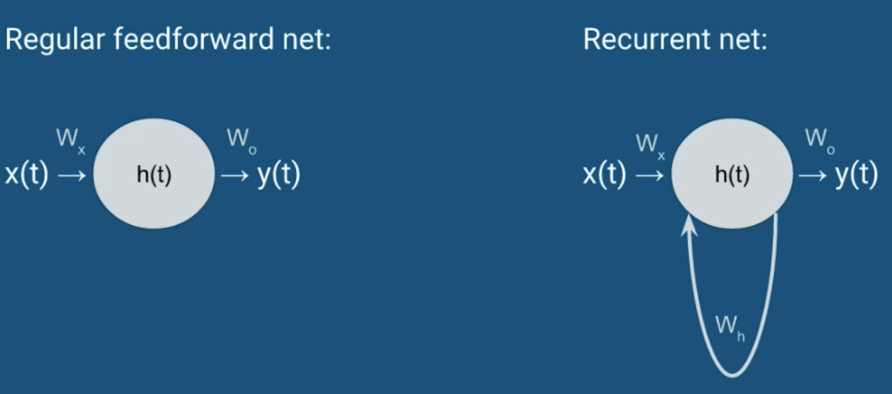
- How big is $W_h$?
- if h(t) is a M-sized vector, $W_h$ is (M,M)

$$\begin{aligned}
h(t) &= f(W_h^T h(t-1) + W_x^Tx(t) + b_h) \\
y(t) &= softmax(W_o^T h(t) + b_o) \\
f &= sigmoid,\ tanh,\ relu
\end{aligned}
$$

- what is h(0)? Just a hyper-parameter, here we make no Markov assumptions, some researchers set it to 0 and make it updated by gradient descent
- Of course, you can add as more than one recurrent layers/units
- Later, you will find you can stack the simple Elman/GRU/LSTM

 
**Prediction and Relationship to Markov Models**

- (1) Make prediction over a entire sequence. 
	- $Prediction(t) = argmax_k\ p(y(t) = k|x) = argmax_k\ softmax(W_o^T h(t) + b_o)$
	- e.g. classifying male vs. female voice
- (2) For every h(t), we can calculate a y(t), we can predict a label for every time step
- (3) Suppose we have a sequence of words, we want to predict next word given all previous words (target is next word)
	- Unsupervised, $p(x(t)|x(t-1), x(t-2), ..., x(1))$ (**not Markov!**)
	- Consider whole sequence:
		- $p(x(1))p(x(2)|x(1))p(x(3)|x(2), x(1))$, join first 2 terms (chain rule of probability): $p(x(2), x(1))p(x(3)|x(2), x(1))$ 
		- Continue to join the first two terms: $p(x(3), x(2), x(1))$
		- ...
		- As you can see, this is just **joint probability** of the sequence. This is similar to Markov model, **BUT NOTE**: we don't make Markov assumptions here

 
**Unfold a RNN**
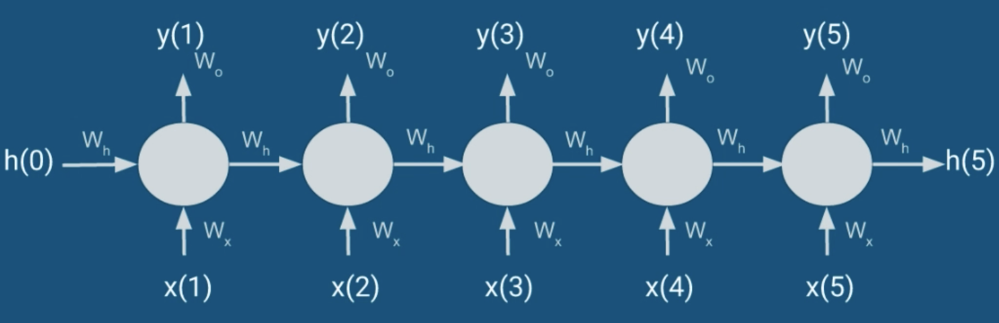

NOTE: W_h is shared weight

 

### Backpropagation Through Time

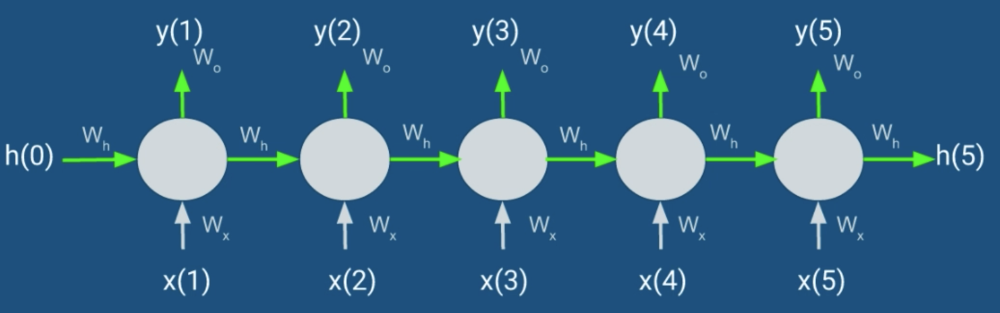

- The influences of $W_h$ are marked in green, the output error for y matters only if there is label for the particular y, i.e. you might have label in the end for the entire sequence, or you might have labels for each time step
- Due to chain rule, same things will be multiplied over and over, which would cause the gradient approach 0 or infinity -- **vanishing gradient or exploding gradient**.
	- one solution for vanishing gradient problem is: gradient clipping
	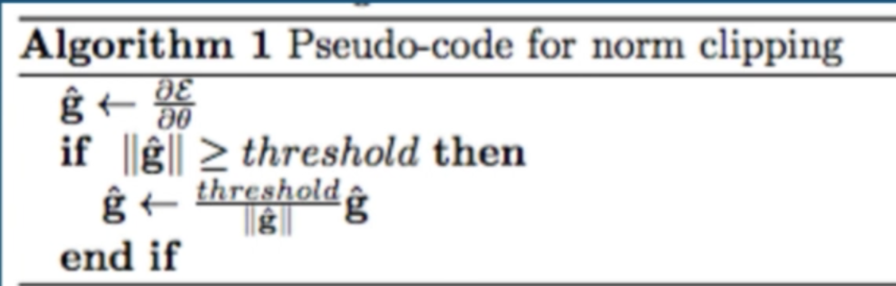

**Trucated BPTT**

- Derivatives w.r.t $W_h$ and $W_x$ depend on every single time step, which takes a long time
- Common approximation: stop after certain number of steps
- Disadvantage: won't incoprate errors at longer periods of time, e.g. if you don't care about depencies 3 times steps before, truncate at 3 time steps. (simialr to Markov assumptions?)

 

**The Parity Problem**

Recall the XOR problem:

- XOR logic gate: same --> 0, different --> 1
	- 00 --> 0
	- 11 --> 0
	- 01 --> 1
	- 10 --> 1
- We can extend this problem by adding more bits: #1s is **odd --> 1**, #1s is **even --> 0**

**How to solve Parity Problem using RNN?**

- Idea: we keep track of some state:
- state = 
	- if 0 and see 1, switch to 1
	- if 1 and see 1, switch to 0
	- if see 0, keep the same state
- we hope RNN will learn to do this - can it work? 

Recall, we have 3 types of labels:

- one label for the entire sequence
- T labels for a sequence of length T
- No labels, just predict next observation

Even thought our target is **1 for odd and 0 for even** for each sequence, we need to convert it into a sequence of targets
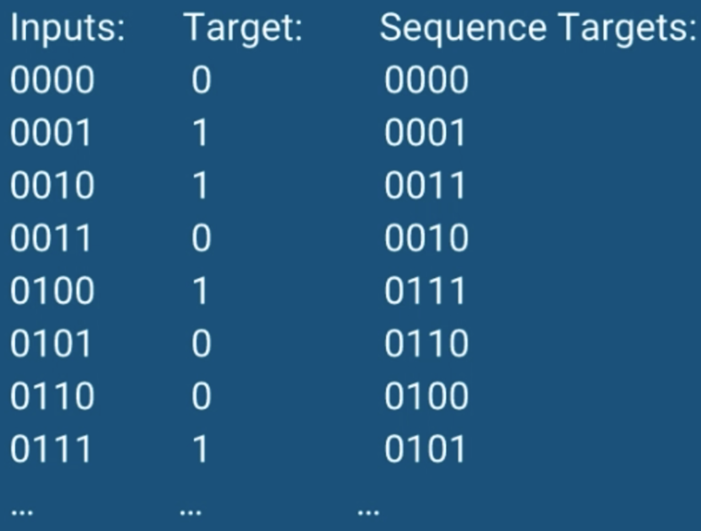

## RNN for NLP
### Word Embeddings and RNN
- Many RNN tutorials use word sequences as examples. Why? Language is easy to comprehend
- RNN finally give us a way to avoid using bag-of-words
	- disadvantages of bag-of-words: it **doesn't consider the word order** and throw a lot of information  
	- bag-of-words is not good at handling negation:
		- e.g. "Today is a good day" vs "Today is not a good day", leads to almost the same vector, except X[not] = 1
		- By comparison, RNN might be good because it keeps state - seeing a "not" might result in negating everything that comes after!

**Word Embeddings + RNN**
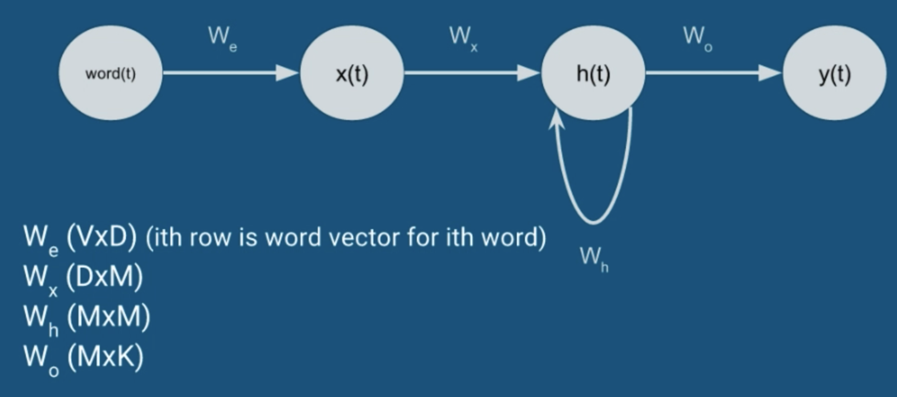

- How to train? Gradient descent! Word2Vec also offers some alternatives to cross-entropy which could speed up training
- What are the targets?
	- Sentiment analysis
	- Next-word prediction
	- Again, Word2Vec also offers alternatives
 
**Similarity or distance of two word vectors**

- Euclidean distance: $||a-b||^2$
- Cosine distance: $1 - \frac{a^Tb}{||a||||b||}$, during training, we often normalize the word vectors so that their length is 1, which means $||a|| = ||b|| = 1$

 

**Representation of a sequence of words as word embeddings**

- Suppose word embeddings/vectors is $W_e$ matrix, shape: (V, D), V = vocab size, D = word vectord dimension
- The length of input sequence of word indices is T, so a (T,D) matrix could reprensent the input sequence
- HOWEVER, we can't make the (T,D) matrix as the input to the neural network, because we want $W_e$ to be an updatable parameter
- Hence, the input is just a list of indices with length T, which is much smaller than input of (T,D) floats

**Example:**

- sentence/sequence: `"I like ice cream"`
- `I=0, like=1, ice=2, cream=7, and=10, cake=5`
- Then, `"I like ice cream"` --> [0,1,2,7]

 

### Generating Poetry
- Unsupervised, softmax output: $p(w(t)|w(t-1), w(t-2), ..., w(0))$
- Sample from the intial word distribution $\pi = p(w(0))$ to get the first word
	- why? Neural Network's output is deterministic, different start words allow us to generate different sequences
	- w(0) = rnn.predict(`START`), w1 = rnn.predict(w(0), `START`), ..., etc.
	- w(t) = argmax(softmax(f(w(t-1), w(t-2), ...)))
- Now, we need word embeddings and SimpleRNN(D,M,V)
- D = embedding size, M = hidden layer size, V = vocan size 
- $W_e$ is (V,D) matrix

**Check out the code: [srn\_language\_tf.py](./srn_language_tf.py)**

 

## Advanced RNN Unites
### Rated RNN
We want to use a matrix called `rate matris z` to weight two things: 

- f(x(t), h(t-1)): output we got from a regular recurrent unit
- h(t-1): previous value of hidden state

**Element-wise** multiplication: $h(t) = (1 - z) \odot h(t-1) + z \odot f(x(t), h(t-1))$

### GRU
- GRU: 2014, LSTM: 1997
- Usually people learn LSTM first
	- It's more popular
	- Was also invented first 
- But GRU is simpler than LSTM, so we will discuss GRU first
	- Same concepts, less parameters 
- Recent research shows GRU and LSTM have comparable performance: [Empirical Evaluation of Gated Recurrent Neural Networks on Sequence Modeling, Chung 2014](https://arxiv.org/pdf/1412.3555v1.pdf) 

#### GRU Architecture
**Let's do a comparison:**

- Feedforward NN:
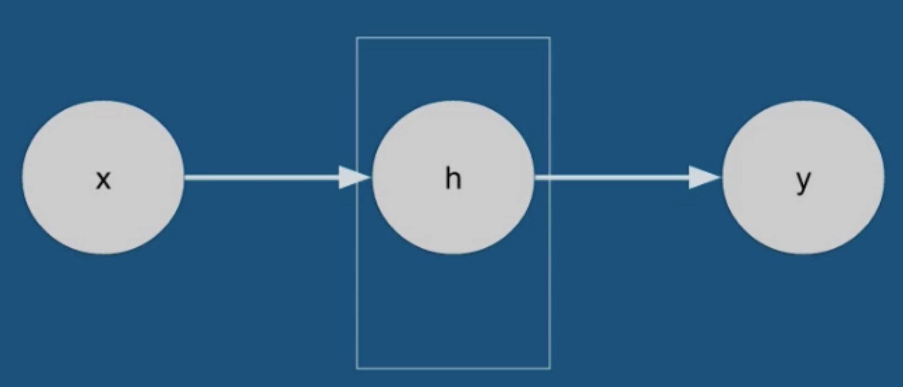
- Simple RNN:
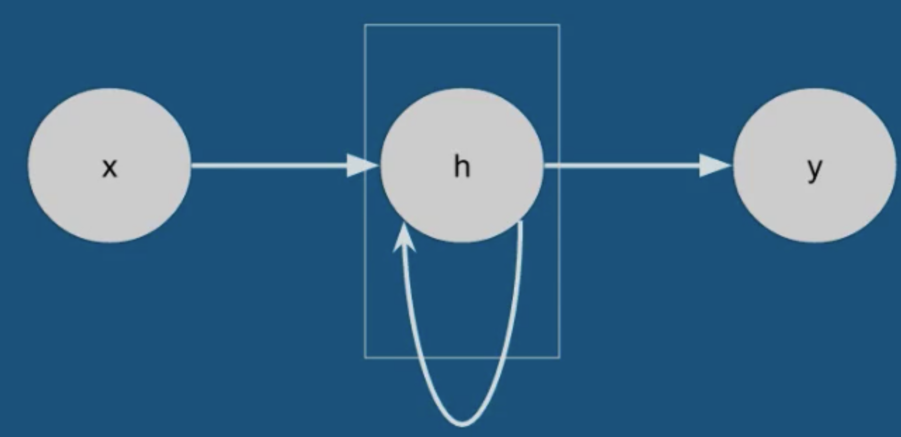
- Rated RNN:
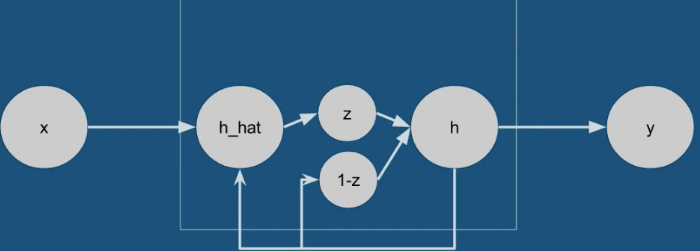
- GRU:
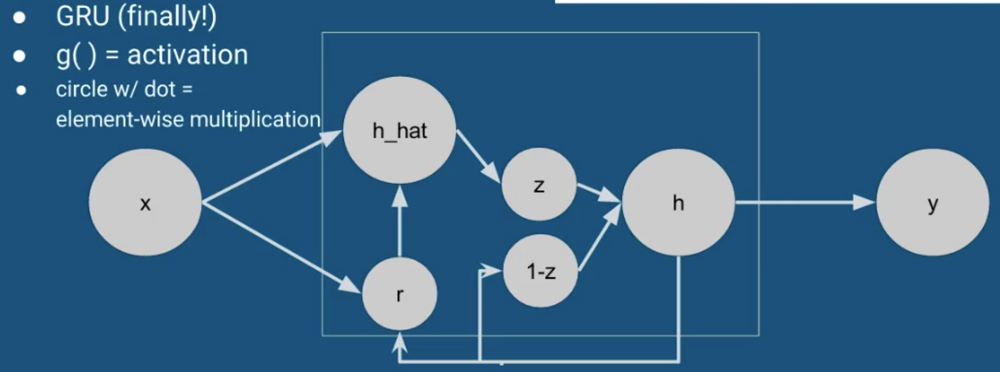
**why z_t needs x_t ??**
$$\begin{aligned}
r_t &= \sigma(x_tW_{xr} + h_{t-1}W_{hr} + b_r) \\
z_t &= \sigma(x_tW_{xz} + h_{t-1}W_{hz} + b_z)) \\
\hat{h}_t &= g(x_tW_{xh} + (r_t \odot h_{t-1})W_{hh} + b_h)\\
h_t &= (1 - z_t) \odot h_{t-1} + z_t \odot \hat{h}_t
\end{aligned}
$$

**How to implement GRU in code?**

- Modularize it, treat it like a black box. 
- Just like we did in creating `HiddenLayer` and `ConvPoolLayer` classes before, we should do the same thing for `GRU` and `LSTM`
- No matter `GRU` or `LSTM`, it's just a thing taking some inputs and produces oututs. The fact that it contains "memory" is just an internal detail of the black box

 

### LSTM
- Long Short-Term Memory
- Each recurrent unit becomes progressively more complex. In fact, it's just adding number of components in each unit
- Basically, in LSTM
	- 3 gaetes: `input, output, forget`
	- `Memory cell c(t)` (no more h_hat) 
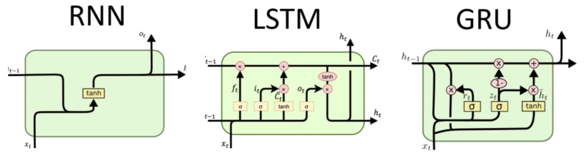
- Input gate `i(t)` and forget gate `f(t)` should remind you of previous rate gate `z(t)`
- In Candidate c(t), $tanh(x_tW_{xc} + h_{t-1}W_{hc} + b_c)$ looks like simple recurrent unit 

$$\begin{aligned}
i_t &= \sigma(x_tW_{xi} + h_{t-1}W_{hi} + c_{t-1}W_{ci} + b_i) \\
f_t &= \sigma(x_tW_{xf} + h_{t-1}W_{hf} + c_{t-1}W_{cf} + b_f)) \\
c_t &= f_tc_{t-1} + i_t tanh(x_tW_{xc} + h_{t-1}W_{hc} + b_c)) \\
o_t &= \sigma(x_tW_{xo} + h_{t-1}W_{ho} + c_tW_{co} + b_o) \\
h_t &= o_t tanh(c_t)
\end{aligned}
$$

**Let's put the parameters of LSTM in a more clear way:**

- Input gate:
	- params: $W_{xi}, W_{hi}, W_{ci}, b_i$ 
	- depends on: $x_t, h_{t-1}, c_{t-1}$
- Forget gate:
	- params: $W_{xf}, W_{hf}, W_{cf}, b_f$ 
	- depends on: $x_t, h_{t-1}, c_{t-1}$
- Candidate gate:
	- params: $W_{xc}, W_{hc}, b_c$ 
	- depends on: $x_t, h_{t-1}$
- Output gate:
	- params: $W_{xo}, W_{ho}, W_{co}, b_o$ 
	- depends on: $x_t, h_{t-1}, c_{t}$

**In conclusion:**

- Totally, we have 15 weights and biases in the black box, compared with feedforward NN: 1 weight, 1 bias
- We just add more parameters to make the model more expressive

 

### Learning from Wikipedia Data

see code: `wiki.py`

**REMAIN UNFINISHED...**

