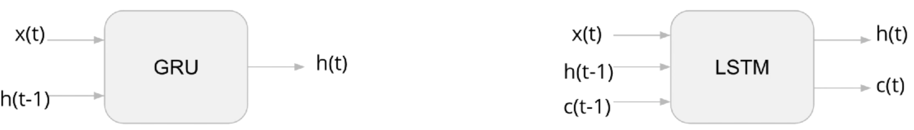
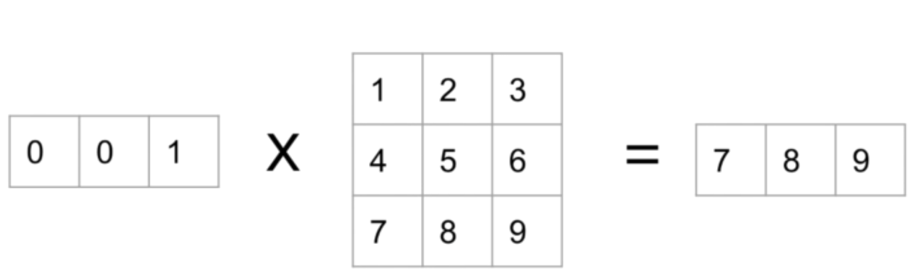

<!-- TOC -->

- [Description](#description)
- [Sequence Data](#sequence-data)
- [Forecast](#forecast)
- [RNN](#rnn)
	- [Simple Recurrent Unit/Elman Unit](#simple-recurrent-unitelman-unit)
	- [Backpropagation Through Time](#backpropagation-through-time)
- [Advanced RNN Unites](#advanced-rnn-unites)
	- [Rated RNN](#rated-rnn)
	- [GRU](#gru)
		- [GRU equations](#gru-equations)
	- [LSTM](#lstm)
		- [LSTM equations](#lstm-equations)
- [RNN for Image Classification](#rnn-for-image-classification)
- [Stock Return Prediction using LSTM](#stock-return-prediction-using-lstm)
- [RNN for NLP](#rnn-for-nlp)
	- [Word Embeddings and RNN](#word-embeddings-and-rnn)
	- [Generating Poetry](#generating-poetry)
	- [Learning from Wikipedia Data](#learning-from-wikipedia-data)

<!-- /TOC -->
 
## Description
This folder is mainly for holding notebooks and .py files for RNN.

The content below is simple introduction of some key components of RNN and pratical tips.

We will start talking from **Simple Recurrent Unit**, also known as the **Elman unit**. After that, we will revisit the **XOR** problem, but we’re going to extend it so that it becomes the **parity** problem - you’ll see that regular feedforward neural networks will have trouble solving this problem **but recurrent networks will work because the key is to treat the input as a sequence.**

Later, we will talk about some applications of recurrent neural networks in NLP, such as **language modeling, word embeddings**(how recurrent neural networks can also be used for creating word vectors)

After that, we’ll look at the very popular **LSTM(long short-term memory unit)**, and the more modern and efficient **GRU(gated recurrent unit)**, which has been proven to yield comparable performance. We’ll also apply these to some more practical problems, such as learning a language model from Wikipedia data and visualizing the word embeddings we get as a result.

<br>

## Sequence Data
RNN is extremely useful and powerful in dealing with sequence data, so let's talk about sequence data first

- Stock return predictions
- Airline passageners prediction
- Weather prediction
- Speech/Audio recognition
- Text related tasks

**Shape of a sequence?**  
- Suppose N = #samples, D = #features, how doe we represent the **length** of a sequence?
- Is it N or D? **Neither**
- Let's use a new letter T, T = sequencce length, an intuitive word cuz "time" starts with "T"


**Eaxmple: Stock Prices**
  
- Here, D=1
- As a simple example, suppose we use window size T=10 to predict next value
- Then N = #windows in the sequence(time series),
  - if we have a sequence of 100 stock prices, how many windows do we have if window size=10?
  - 100 - 10 + 1 = 91
  - In general, if we have a sequence of length L, and a window size T, then we have `L - T + 1` windows
- What if we want to **meaasure more than one stock price**, like `S&P500` measuring 500 different stocks?
  
  - Then now D=500
  - If window size T is 10, then the size of a single sample will be `T x D = 10 x 500 = 5000`

**Why `N x T x D` instead of `N x D x T`**  
- It's just a convention/standard most ML libraries in Python follows
- Think about tabular data: N x D, D = #features
- Think about image data: N x H x W x C, C = #color channels, #feature maps
- In general, we'd like to put #features at last
<br>

## Forecast
**What is the simplest way to do a forecast given a 1D time series?  **
- linear regression
- suppose we have a time series of length 10, we want to predict next value based on the past 3 values
  - input matrix X will be shape of N x 3, target Y will be shape N
  - so what is N? 10 - 3 + 1 = 8? 
  - Actually, NO, **N=7! because we were actually using windows of length 4**, we don't have X11:
  
  - $\hat{x_t} = w_0 + w_1x_{t-1} + w_2x_{t-2} + w_3x_{t-3}$
  - This is called **autoregressive(AR)** model in statistics literature

**How do we forecast?**  
- We want to predict *multiple* steps ahead
- If we want to predict 3 days ahead, e.g. (x1,x2,x3) to predict (x4,x5,x6), how to do it?
  $$\begin{aligned}
  \hat{x_4} = w_0 + w_1x_1 + w_2x_2 + w_3x_3 \\
  \hat{x_5} = w_0 + w_1x_2 + w_2x_3 + w_3 \hat{x_4} \\
  \hat{x_6} = w_0 + w_1x_3 + w_2 \hat{x_4} + w_3 \hat{x_5} \\
  \end{aligned}
  $$

**All ml interfaces are the same**
- Can we apply the same rule to make a more powerful predictions? Yes!
- Limitation of linear regression: model could only capture linear relation
- How about ANN:
  - code for linear regression
	```python
	i = Input(shape=(T,))
	x = Dense(1)(i)

	model = Model(i, x)
	```
  - code for ANN
	```python
	i = Input(shape=(T,))
	x = Dense(10, activation='relu')(i)
	x = Dense(1)(i)

	model = Model(i, x)
	```

<br>

## RNN
### Simple Recurrent Unit/Elman Unit

- Usually, we are dealing with data X in shape of (N, D) matrix
- Suppose now we are dealing with a sequence of data, each sequence is of length T
- All sequences: (N,T,D)
- What if sequences are not equal length? (sound/music/sentences)
	- Store in a list, the nth element is T(n) * D

- How big is $W_{h}$?
- if h(t) is a M-sized vector, $W_h$ is (M,M)

$$\begin{aligned}
h(t) &= f(W_{hh}^T h(t-1) + W_{xh}^Tx(t) + b_h) \\
y(t) &= softmax(W_o^T h(t) + b_o) \\
f &= sigmoid,\ tanh,\ relu
\end{aligned}
$$

- **what is h(0)**? Just a hyper-parameter, here we make no Markov assumptions, some researchers set it to 0 and make it updated by gradient descent (**HOWEVER, in TensorFlow, it's not learnavke -- just assume it's 0**)
- Of course, you can add as more than one recurrent layers/units
- Later, you will find you can stack the simple Elman/GRU/LSTM
<br>

**Prediction and Relationship to Markov Models**

- (1) **Make prediction over a entire sequence**. 
	- $Prediction(t) = argmax_k\ p(y(t) = k|x) = argmax_k\ softmax(W_o^T h(t) + b_o)$
	- e.g. classifying male vs. female voice
- (2) For every h(t), we can calculate a y(t), we can **predict a label for every time step**
- (3) Suppose we have a sequence of words, we want to **predict next word given all previous words** (target is next word)
	- Unsupervised, $p(x(t)|x(t-1), x(t-2), ..., x(1))$ (**not Markov!**)
	- Consider whole sequence:
		- $p(x(1))p(x(2)|x(1))p(x(3)|x(2), x(1))$, join first 2 terms (chain rule of probability): $p(x(2), x(1))p(x(3)|x(2), x(1))$ 
		- Continue to join the first two terms: $p(x(3), x(2), x(1))$
		- ...
		- As you can see, this is just **joint probability** of the sequence. This is similar to Markov model, **BUT NOTE**: we don't make Markov assumptions here

<br>

**Unfold a RNN**
 


**NOTE**:  
- $W_{xh}$ and $W_{hh}$ are **shared** weights
- **Params saving** of RNN compared to ANN:
- Let's say T=100, D=10, M=15
- For ANN:
  - Flatten the input: T x D = 1000
  - We have T hidden states: **T x M = 1500**
  - Assume binary classification: K = 1
  - Input-to-hidden weight: 1000 x 1500 = 1.5 million
  - Hidden-to-output weight: 1500 x 1 = 1500
  - **Total: 1.5 million**
- For RNN:
  -  $W_{xh}$: D x M = 10 x 15 = 150
  -  $W_{hh}$: M x M = 15 * 15 = 225
  -  $W_o$: M x K = 15 x 1 = 15
  -  **Total: 150 + 225 + 15 = 390**
- In addition, **as we increase T**, you will find out #params will keep increasing while #parmas of RNN will stay the same! 

<br>

### Backpropagation Through Time


- The influences of $W_h$ are marked in green, the output error for y matters only if there is label for the particular y, i.e. you might have label in the end for the entire sequence, or you might have labels for each time step
- Due to chain rule, same things will be multiplied over and over, which would cause the gradient approach 0 or infinity -- **vanishing gradient or exploding gradient**.
	- one solution for vanishing gradient problem is: gradient clipping
	

**Trucated BPTT**

- Derivatives w.r.t $W_h$ and $W_x$ depend on every single time step, which takes a long time
- Common approximation: stop after certain number of steps
- Disadvantage: won't incoprate errors at longer periods of time, e.g. if you don't care about depencies 3 times steps before, truncate at 3 time steps. (simialr to Markov assumptions?)

<br>

**The Parity Problem**

Recall the XOR problem:

- XOR logic gate: same --> 0, different --> 1
	- 00 --> 0
	- 11 --> 0
	- 01 --> 1
	- 10 --> 1
- We can extend this problem by adding more bits: #1s is **odd --> 1**, #1s is **even --> 0**

**How to solve Parity Problem using RNN?**

- Idea: we keep track of some state:
- state = 
	- if 0 and see 1, switch to 1
	- if 1 and see 1, switch to 0
	- if see 0, keep the same state
- we hope RNN will learn to do this - can it work? 

Recall, we have 3 types of labels:

- one label for the entire sequence
- T labels for a sequence of length T
- No labels, just predict next observation

Even thought our target is **1 for odd and 0 for even** for each sequence, we need to convert it into a sequence of targets


[code of predicting sine wave using simple AR model](https://colab.research.google.com/drive/1rlv5LDCXWEpOUg7UzuwD69VY1xwZEBQ4#scrollTo=EESqey3TsODi)

[code of predicting sine wave using RNN](https://colab.research.google.com/drive/1D4Xikjb4C7il6pimAklC8kFH-31ghKei#scrollTo=EESqey3TsODi)

**[Pay attention to Shape](https://colab.research.google.com/drive/1ZR0BriIV2CQnrojL6caXZ9ugQIc9vQF8#scrollTo=HEaTepN8aKLw)**

<br>

## Advanced RNN Unites
### Rated RNN
We want to use a matrix called `rate matris z` to weight two things: 

- f(x(t), h(t-1)): output we got from a regular recurrent unit
- h(t-1): previous value of hidden state

**Element-wise** multiplication: $h(t) = (1 - z) \odot h(t-1) + z \odot f(x(t), h(t-1))$

### GRU
- GRU: 2014, LSTM: 1997
- Usually people learn LSTM first
	- It's more popular
	- Was also invented first 
- But **GRU is simpler than LSTM**, so we will discuss GRU first
	- Same concepts, **less parameters** 
- Recent research shows GRU and LSTM have comparable performance: [Empirical Evaluation of Gated Recurrent Neural Networks on Sequence Modeling, Chung 2014](https://arxiv.org/pdf/1412.3555v1.pdf) 

**Why do we need GRU/LSTM?**  
- Just because GRU/LSTM is fancy? NO!
- RNN is vulnerable to the **vanishing gradient** problem
- Simple RNN can't learn from inputs/senquences too far back!

**GRU Architecture**
**Let's do a comparison:**

- Feedforward NN:

- Simple RNN:

- Rated RNN:

- GRU:


#### GRU equations

Recall, a **simple RNN**:  
$$\begin{aligned}
h_t = tanh(W_{xh}^Tx_t + W_{hh}^Th_{t-1} + b_h)
\end{aligned}
$$

**GRU**:  
- **z(t): update** gate vector
- **r(t): reset** gate vector
- **h(t): hidden** state vector
- **$\hat{h}_t$: temporary new hidden** state vector
- All of the 4 vectors have size M (#hidden units)
  
$$\begin{aligned}
r_t &= \sigma(W_{xr}^Tx_t + W_{hr}^Th_{t-1} + b_r) \\
z_t &= \sigma(W_{xz}^Tx_t + W_{hz}^Th_{t-1} + b_z)) \\
\hat{h}_t &= tanh(W_{xh}^Tx_t + W_{hh}^T(r_t \odot h_{t-1}) + b_h)\\
h_t &= (1 - z_t) \odot h_{t-1} + z_t \odot \hat{h}_t
\end{aligned}
$$

**What is GRU doing?**  

**$z_t$ = update gate vector**  
- It simply does one thing: **determine the ratio** of using new value for $h_t$, i.e $\hat{h}_t$ and keeping old value $h_{t-1}$
- Recall, vanishing gradient means simple RNN easily forget things in the past
- Now, we use $z_t$ to explicitly remember the previous $h_{t-1}$
  - If $z_t$ is 1, we totally forget $h_{t-1}$
  - If $z_t$ is 0, we only remember $h_{t-1}$
- NOTE: $z_t$ is basically a **neuron** with sigmoid function, so $z_t$ is in the range of (0, 1) 

**$r_t$ = reset gate vector**  
- Same as $z_t$, just another neuron, another "switch" to remember/forget $h_{t-1}$
- NOTE: $r_t \odot h_{t-1}$, $\odot$ is **element-wise** multiplication, and $r_t$ is again a probability within the range of (0, 1), which means $r_t$ controls how much the model should remember/keep for each element of $h_{t-1}$


**How to implement GRU in code?**

- Modularize it, treat it like a black box. 
- Just like we did in creating `HiddenLayer` and `ConvPoolLayer` classes before, we should do the same thing for `GRU` and `LSTM`
- No matter `GRU` or `LSTM`, it's just a thing taking some inputs and produces oututs. The fact that it contains "memory" is just an internal detail of the black box

**GRU Summary**  
- Same API as simple RNN
- Output is h(t), inputs are $h_{t-1}, x_{t}$
- Gate to **remember / forget** each component of $h_{t-1} \rightarrow r_t$
- Gate to **control the ratio** of $h_{t-1}, \hat{h}_t \rightarrow z_t$
- Simple RNN has no choice but to evetually forget previous information due to vanishing gradient
- Gates are just **logistic regression neurons**

<br>

### LSTM
- Long Short-Term Memory
- Each recurrent unit becomes progressively more complex. In fact, it's just **adding more components** in each unit
- Basically, in LSTM
	- 3 gaetes: `input, output, forget`
	- `Memory cell c(t)` (no more h_hat) 
- Input gate `i(t)` and forget gate `f(t)` should remind you of previous rate gate `z(t)`
- In Candidate c(t), $tanh(x_tW_{xc} + h_{t-1}W_{hc} + b_c)$ looks like simple recurrent unit 

  - Personally, I found the diagram of LSTM/GRU is hard to memorize, the formula itself is easy to remember if you truly understand how LSTM/GRU works

**GRU vs LSTM**  
- Not exactly the same API
- LSTM takes **3 inputs** and returns **2 states**:
  - There is one more state: cell state $c_t$, usually serves as the intermediate value calculated
  - It also means, we need 2 intial states: $c_0$ and $h_0$
  - LSTM in TensorFlow outputs $h_t$, but can also optionally output $c_t$
  

#### LSTM equations
**Remember each of these is just a neuron!!!**  
$$\begin{aligned}
i_t &= \sigma(W_{xi}^Tx_t + W_{hi}^Th_{t-1} + b_i) \\
f_t &= \sigma(W_{xf}^Tx_t + W_{hf}^Th_{t-1} + b_f) \\
o_t &= \sigma(W_{xo}^Tx_t + W_{ho}^Th_{t-1} + b_o) \\
c_t &= f_t \odot c_{t-1} + i_t \odot tanh(W_{xc}^Tx_t + W_{hc}^Th_{t-1} + b_c)) \\
h_t &= o_t \odot tanh(c_t)
\end{aligned}
$$

**Let's put the parameters of LSTM in a simple way:**
- f(t) = neuron (binary logistic classifier)
- i(t) = neuron (binary logistic classifier)
- o(t) = neuron (binary logistic classifier)
- c(t) = f(t) * c(t-1) + i(t) * SimpleRNN
- h(t) = o(t) * tanh(c(t))

**In tf 2.0 code**  
Simple RNN  

```python
i = Input(shape=(T,D))
x = SimpleRNN(M)(i)
x = Dense(K)(x)
model = Model(i, x)
```

LSTM

```python
i = Input(shape=(T,D))
x = LSTM(M)(i)
x = Dense(K)(x)
model = Model(i, x)
```

**Options for RNN units in tf 2.0:**  
- `o, h = SimpleRNN(M, return_state=True)(i)`
  - `o` and `h` are the same thing - final state $h_t$
- `o, h = GRU(M, return_state=True)(i)`
  - `o` and `h` are the same thing - final state $h_t$
- `o, h, c = LSTM(M, return_state=True)(i)`
  - `o` and `h` are the same thing - final state $h_t$
  - `c` is $c_t$

**In conclusion:**

- Totally, we have 15 weights and biases in the black box, compared with feedforward NN: 1 weight, 1 bias
- We just add more parameters to make the model more expressive

Use case when auto-reregressive model performs badly compared to RNN & LSTM  

[Code for LSTM Nonlinear](https://colab.research.google.com/drive/1miNkoQ2KhSy4WJhcIO3S7IdjTc9HC6oK#scrollTo=jnB3rrIViDKw)

Also noted: LSTM is not perfect for every sequence prediction problem. But when you see the code example below, you will find LSTM really works well in capaturing long distance relationship/dependency:

[Long Distance](https://colab.research.google.com/drive/1lXl4zyW29octaRG66MtjMyp6lHDnzNAq#scrollTo=_iAHEiAy5BOW)

In the above code, you will see the performance of comparison among:  
- SimpleRNN
- LSTM
- GRU
- LSTM + Global Max Pooling

<br>

## RNN for Image Classification
It's interesting to think using RNN to deal with image classification problem

[LSTM MNIST](https://colab.research.google.com/drive/1-PalWi8hatYa3tcusOW235gd4IOPkNCd#scrollTo=ficPkqT2bgvE)

<br>

## Stock Return Prediction using LSTM
[Stock Return Prediction](https://colab.research.google.com/drive/1FXhRZAJvoCT879aLDF6MX77wNVG-pMwL#scrollTo=jbpmvNNiLI2w)

<br>

## RNN for NLP
- Previously, we used RNNs for modeling sequence data
- Text is also sequence data, but it's not continuous as before.It's **categorical**!

**You can refer some materials about NLP techniques here: (UNFINISHED)**
- (1)
- ...

### Word Embeddings and RNN
- Many RNN tutorials use word sequences as examples. Why? Language is easy to comprehend
- RNN finally give us a way to avoid using bag-of-words
	- disadvantages of bag-of-words: it **doesn't consider the word order** and throw a lot of information  
	- bag-of-words is not good at handling negation:
		- e.g. "Today is a good day" vs "Today is not a good day", leads to almost the same vector, except X[not] = 1
		- By comparison, RNN might be good because it keeps state - seeing a "not" might result in negating everything that comes after!

**Word Embeddings + RNN**


- How to train? Gradient descent! Word2Vec also offers some alternatives to cross-entropy which could speed up training
- What are the targets?
	- Sentiment analysis
	- Next-word prediction
	- Again, Word2Vec also offers alternatives
 
**Similarity or distance of two word vectors**

- Euclidean distance: $||a-b||^2$
- Cosine distance: $1 - \frac{a^Tb}{||a||||b||}$, during training, we often normalize the word vectors so that their length is 1, which means $||a|| = ||b|| = 1$


**Representation of a sequence of words as word embeddings**

- Suppose word embeddings/vectors is $W_e$ matrix, shape: (V, D), V = vocab size, D = word vectord dimension
- The **length** of input sequence is T, so a (T, D) matrix could reprensent the input sequence
- HOWEVER, we can't make the (T, D) matrix as the input to the neural network, because we want $W_e$ to be an updatable parameter
- Hence, **the input is just a list of indices with length T**, which is much smaller than input of (T, D) floats

**Example:**

- sentence/sequence: `"I like ice cream"`
- `I=0, like=1, ice=2, cream=7, and=10, cake=5`
- Then, `"I like ice cream"` --> [0,1,2,7]

**Coding Trick for one-hot encoding**  
Suppose we multiply a one-hot encoded vector by a matrix:

**...**

- If the index set to 1 is at position 1, we get the 1st row
- If the index set to 1 is at position 2, we get the 2ndrow
- If the index set to 1 is at position 3, we get the 3rd row
- ...

- **one_hot(k) * W = W[k]**, simply index kth row of W would give us the multiplication results:
  - Suppose we want to multiply a length V one-hot vector by a V x D matrix
  - By using the efficient "index method", time complexity reduced from O(VD) to O(1) (**constant time!**)
  - Actually, this is exactly what Embedding layer in TensorFlow does!
    - Step 1: Convert words into **unique** integers/indices: ['I', 'like', 'cats'] --> [50, 25, 3]
    - Step 2: Use the integers to index embedding matrix to get corresponding word vectors: [50, 25, 3] --> [ [0.3. 0.5], [1.2, -0.7], [-2.1, 0.9] ]

<br>

**Full RNN for simple text classification** 
```python
i = Input(shape=(T,))
x = Embedding(V, D)(i) # x is now an N x T x d matrix
x = LSTM(M)(x)
x = Dense(K, activation='softmax')

# alternative
i = Input(shape=(T,))
x = Embedding(V, D)(i) # x is now an N x T x d matrix
x = LSTM(M, return_sequence=True)(x)
x = GlobalMaxPooling1D()(x)
x = Dense(K, activation='softmax')
```


### Generating Poetry
- Unsupervised, softmax output: $p(w(t)|w(t-1), w(t-2), ..., w(0))$
- Sample from the intial word distribution $\pi = p(w(0))$ to get the first word
	- why? Neural Network's output is deterministic, different start words allow us to generate different sequences
	- w(0) = rnn.predict(`START`), w1 = rnn.predict(w(0), `START`), ..., etc.
	- w(t) = argmax(softmax(f(w(t-1), w(t-2), ...)))
- Now, we need word embeddings and SimpleRNN(D,M,V)
- D = embedding size, M = hidden layer size, V = vocan size 
- $W_e$ is (V,D) matrix

**Check out the code: [srn\_language\_tf.py](./srn_language_tf.py)**

<br>

### Learning from Wikipedia Data
see code: `wiki.py`


**REMAIN UNFINISHED...**


