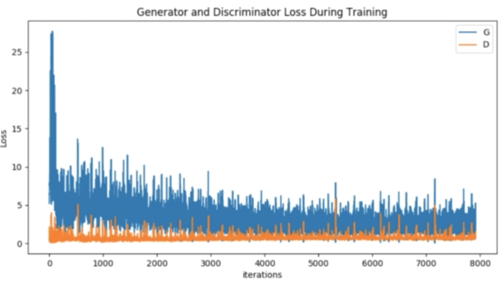

<!-- TOC -->

- [Description](#description)
- [Google Colab](#google-colab)
- [Machine Learning and Neurons](#machine-learning-and-neurons)
- [Feedforward Neural Network](#feedforward-neural-network)
  - [Forward Propagation](#forward-propagation)
  - [Geometrical picture](#geometrical-picture)
  - [Activation functions](#activation-functions)
  - [Multiclass classification](#multiclass-classification)
- [CNN](#cnn)
- [RNN, Time Series, and Sequence Data](#rnn-time-series-and-sequence-data)
- [NLP](#nlp)
- [Recommender System](#recommender-system)
- [Transfer Learning for CV](#transfer-learning-for-cv)
  - [Transfer Learning Theory](#transfer-learning-theory)
  - [Some pre-trained models](#some-pre-trained-models)
    - [VGG](#vgg)
    - [ResNet](#resnet)
    - [Inception](#inception)
    - [MobileNet](#mobilenet)
  - [Large datasets and Data generators](#large-datasets-and-data-generators)
  - [Approaches to Transfer Learning](#approaches-to-transfer-learning)
- [GAN](#gan)
- [Deep Reinforcement Learning](#deep-reinforcement-learning)
  - [Introduction](#introduction)
  - [Elements/Terminologies of RL](#elementsterminologies-of-rl)
  - [States, Actions, Rewards, Policies](#states-actions-rewards-policies)
    - [Policy as probability](#policy-as-probability)
  - [Markov Decision Process(MDP)](#markov-decision-processmdp)
  - [Value Functions and the Bellman Equation](#value-functions-and-the-bellman-equation)
  - [How to learn in RL system?](#how-to-learn-in-rl-system)
  - [Solving the Bellman Equation with RL](#solving-the-bellman-equation-with-rl)
  - [Epsilon-Greedy](#epsilon-greedy)
  - [Q-Learning](#q-learning)
  - [Deep Q-Learning](#deep-q-learning)
  - [How to learn RL](#how-to-learn-rl)
- [Stock Trading Project with Deep RL](#stock-trading-project-with-deep-rl)
  - [Introduction](#introduction-1)
  - [Data and Environment](#data-and-environment)
  - [Replay Buffer](#replay-buffer)
    - [Efficient replay buffer design](#efficient-replay-buffer-design)
  - [Program Layout and Design](#program-layout-and-design)
  - [RL Trader Discussion](#rl-trader-discussion)
- [Advanced TensorFlow Usage](#advanced-tensorflow-usage)
  - [Tensorflow Serving](#tensorflow-serving)
  - [TensorFlow Lite](#tensorflow-lite)
  - [Training with Distributed Strategies](#training-with-distributed-strategies)
    - [Mirroed Strategy](#mirroed-strategy)
  - [Using TPU](#using-tpu)
- [Low-Level TensorFlow](#low-level-tensorflow)
  - [Building Custom Layers](#building-custom-layers)
  - [Constants and Basic Computation](#constants-and-basic-computation)
  - [Variables and Gradient Tape](#variables-and-gradient-tape)
  - [Build Your Custom Model](#build-your-custom-model)

<!-- /TOC -->

<br>

## Description
This folder is mainly for holding notebooks and .py files for learning TensorFlow 2.0.

The content below will cover simple instruction of how to use TensorFlow 2.0 to build some very basic machine learning models and gradually advance to state of the art concepts.

We will talk talk abour major deep learning architectures, such as Deep Neural Networks, Convolutional Neural Networks (image processing), and Recurrent Neural Networks (sequence data).

**We will use TF 2.0 to finish some tasks/projects, such as:**

- Natural Language Processing (NLP)
- Recommender Systems
- Transfer Learning for Computer Vision
- Generative Adversarial Networks (GANs)
- Deep Reinforcement Learning Stock Trading Bot

**Advanced Tensorflow topics include:**

- Deploying a model with **Tensorflow Serving** (Tensorflow in the cloud)
- Deploying a model with **Tensorflow Lite** (mobile and embedded applications)
- Distributed Tensorflow training with **Distribution Strategies**
- Writing your own **customized Tensorflow model**
- Converting Tensorflow 1.x code to Tensorflow 2.0
- Constants, Variables, and Tensors
- Eager execution
- Gradient tape

**To be more specific, you’ll learn:**

- Artificial Neural Networks (ANNs) / Deep Neural Networks (DNNs)
- Convolutional Neural Networks (CNNs)
  - Computer Vision
  - Image Recognition
- Recurrent Neural Networks (RNNs)
  - NLP tasks
  - Predict Stock Returns
  - Time Series Forecasting
- How to build a Deep Reinforcement Learning Stock Trading Bot
- GANs (Generative Adversarial Networks)
- Recommender Systems
- Transfer Learning to create state-of-the-art image classifiers
- Use `Tensorflow Serving` to serve your model using a RESTful API
- Use `Tensorflow Lite` to export your model for mobile (Android, iOS) and embedded devices
- Use Tensorflow's Distribution Strategies to parallelize learning
- Low-level Tensorflow, gradient tape, and how to build your own custom models

<br>

## Google Colab
[How do I install a library permanently in Colab?](https://stackoverflow.com/questions/55253498/how-do-i-install-a-library-permanently-in-colab)

[How to upload your own data to Colab](https://colab.research.google.com/drive/1MIG0-5EZGoAElw8vQb__CfeYrkvmjfUE#scrollTo=rVEHK63cWhe2)

## Machine Learning and Neurons

[Classification notebook](https://colab.research.google.com/drive/15wpce_tlt5NLAIwjFyuoaa8CQ4-kb-BZ#scrollTo=y-llhgXY5bmX)

[Regression Notebook](https://colab.research.google.com/drive/11z_CyYByuTtDwh4auDqhO4VWY0_Jlz7w#scrollTo=4Xxa6cWIDsax)

## Feedforward Neural Network
### Forward Propagation

- A feedforward neural network is consisted of many layers of neurons
- You could regard each neuron as a simple logistic regression
- There are 2 important ways to extend a single neuron:
    

**Lines to neurons:**


$$\begin{aligned}
A\ line&:\ ax + b \\
A\ neuron&:\ \sigma(w^Tx + b)
\end{aligned}
$$

**Multiple neurons per layer:**  
<div  align="center">

</div>

$$z_j = \sigma(w_j^Tx + b_j),\ for\ j=1...M$$

**Vectorize the computation:**  
- Conssider z to be a vector of size M
- Shapes:
  - z is a vector of size M(shape: (M,1))
  - x is a vector of size D(shape: (D,1))
  - W is a matrix of size DxM
  - b is a vector of size M
  - $\sigma()$ is an element-wise operation
  $$\begin{aligned}
  z_j &= \sigma(w_j^Tx + b_j),\ for\ j=1...M) \\ 
  &\Downarrow \\
  z &= \sigma(W^Tx + b)
  \end{aligned}
  $$

**Input to output for an L-layer NN:**  


- For classification:

$$\begin{aligned}
z^{(1)} &= \sigma(W^{(1)T}x + b^{(1)}) \\ 
z^{(2)} &= \sigma(W^{(2)T}x + b^{(2)}) \\
z^{(3)} &= \sigma(W^{(3)T}x + b^{(3)}) \\
... \\
p(y=1|x) &= \sigma(W^{(L)T}z^{(L-1)} + b^{(L)}
\end{aligned}
$$

- For regression:
  - Simply change the output of last layer to: $\hat{y} = W^{(L)T}z^{(L-1)} + b^{(L)}$, which is very similary to linear regression

**Another perspective**

<br>

### Geometrical picture
[Tensorflow Playground](https://playground.tensorflow.org/)
<br>

### Activation functions
**sigmoid: $\sigma(W^Tx) = \frac{1}{1 + exp(-W^Tx)}$** 


**Problems with sigmoid:**  
- Recall, we prefer data input is centered around 0 and approximately the same range
- Output of sigmoid is [0, 1], center is 0.5, hence its output can never be centered around 0, and the output is the input of next layer, which means the mean of the "input" in the latter layers can never be around 0

**tanh(Hyperbolic tangent): $\tanh(W^Tx) = \frac{exp(2W^Tx - 1)}{exp(2W^Tx - 1)}$**  

- You could prove that `tanh` is just a scaled & vertically shifted version of `sigmoid`

**Problems with sigmoid & tanh:**  
- Vanishing gradient problem:
  - This is the very common issue for deep NN, suppose $output=\sigma(...\sigma(...\sigma(...)))$
  - When we do gradient descent, we need to use chain rule to multiply the derivative of the sigmoid/tanh over and over again to update the params:
$$\frac{\partial J}{\partial W^{(1)}} = \frac{\partial J}{\partial z^{(L)}} \frac{\partial z^{(L)}}{\partial z^{(L-1)}}... \frac{\partial z^{(2)}}{\partial z^{(1)}} \frac{\partial z^{(2)}}{\partial z^{(1)}}\frac{\partial z^{(1)}}{\partial W^{(1)}}$$

- Why are tiny derivative is a problem?
  - Suppose the max value 0.25 is multiplied by itself 5 times: $0.25^5 \approx 0.001$
  - What if we have 0.1 multiplied by itself 5 times:$0.1^5=0.00001$
  - Result: the further back the gradient propagate to the previous layer of the network, the smaller it would become!

**ReLu**
Solution to the vanish gradient problem is: **simply don't use activation functions with vanishing gradients**

Instead, use **ReLu(Rectifier Linear Unit)**


- But wait a minute, the gradient of ReLu in the left half part(x < 0) is 0!!!, which is already vanished! This phenomenon is called "dead neuron" problem
- **HOWEVER**, in deep learning, the experiment results show that it's not a problem, it works very good!

There are some variant ReLu, which try to solve the "dead neuron" problem:  
- Leaky ReLu(LReLu)

- Exponential Linear Unit(ELU)

- Softplus: $f(x) = log(1 + e^x)$


**Default(Recommendation):** ReLu is proven to be a default good choise by many experiments

### Multiclass classification
**Comparison among regression, binary classification, multi-class classification**
  


## CNN
Refer to [CNN.md](../CNN/CNN.md)

<br>

## RNN, Time Series, and Sequence Data
Refer to [RNN.md](../RNN/RNN.md)

<br>

## NLP
[Code for Text Preprocessing](https://colab.research.google.com/drive/12hIIbOA--NB4l-7nHCqyV0Z1R3y6ieVF#scrollTo=31eDMQixm5rV)

[Code for Spam Detection RNN](https://colab.research.google.com/drive/1amjBDZQ0cE8hgFP1AcEgAFbDiNyIU0gF)

[Code for Spam Detection CNN](https://colab.research.google.com/drive/1wRqJYZ5qN9Yqq0HW7NDD9dkiFh9160Qe)


<br>

## Recommender System
This section just aims to give a simple introduction about deep learning application on Recommender System. For detailed instructions, please refer to [.md]()

**How to recommend from DL perspective?**  
- Given a dataset triples: (user, item, rating)
- Fit a model to the data: f(u, m) --> r
- What should it do?
  - (1) if the ``user u`` and ``movie m`` appeared in the dataset, the predicted rating should be close to the true rating
  - (2) the function should predict **what `user u` would rate `movie m`, when `user u` haven't seen `movie m` yet!**
- **How to recommend?**
  - Given a user, get prediction for every unseen moview
  - Sort the rating, recommend the highest predicted rating movie(s)
- **How to build the model?**
  - A neural network for recommenders:
  
  - NOTICE: We have to use **Functional API of TF 2.0** here, because we have 2 inputs appearing in parallel, sequential layer won't support this!
  
[Code for Recommender System](https://colab.research.google.com/drive/1S5kYAgNvg6Z_vjeR2Pe3ch637fktW0bk#scrollTo=VlGdCKsveyY6)

<br>

## Transfer Learning for CV
### Transfer Learning Theory
**Intutition:**  
- Main idea: the features learned from one task may be useful for another task
- Example:
  - ImageNet - Large-scale image dataset (millions of images, 1k categories)
  - Because the dataset is so diverse, weightes trained on this dataset can be applied to a large number of vision tasks
    -  Cats vs Dogs, easy
    -  Cars vs Trucks, easy
    -  Even microscope images, which are never seen in ImageNet before!

**Training on ImageNet**  
- Training from scratch by yourself would take a long time!
- Better way is to use some publicly-released pre-trained weights that have won past ImageNet contests
- Lucily, many of the pre-trained models are included in TensorFlow/Keras!

Recall, CNN could be regarded as consisting of **2 parts**:  


**What we do in Transfer Learning:**  
- **Freeze** params of the "body"
- **Train** only on the params of the "head"!
  


**Advantages of Transfer Learning**  
- No need for a lot of data to build SOTA model
- Fast to train!
  


<br>

### Some pre-trained models
#### VGG
- Options: `VGG16, VGG19`


#### ResNet
- A CNN with branches
  - one branch is identity function
  - another learns the residual
- Variations: `ResNet50, ResNet101, ResNet152, ResNet_v2, ResNeXt `


#### Inception
- Multiple convolution iin parallel branches
- Instead of trying to choose different filter sizes(1x1, 3x3, 5x5, etc.), just try them all!


#### MobileNet
- Lightweight: makes a tradeoff between speed and accuracy
- Meant for less powerful machine (mobile, embedded devices)
  


**Watch out: Preprocessing!**  
- Since we are using pre-built CNNs, our data must be formatted just like the original!
  

<br>

### Large datasets and Data generators
**Large image datasets**
A quick questuion -- how much space does it take to store 1 million images of size 224 x 224? 
- 1 million images x (224 x 224 x 3) bytes/image 
- ~ 150 billion bytes ~ 140 GB
- Would not fit in RAM on a standard machine
- So how to train a model on such big dataset?
  - Simple! Because we normally use batch-gradient descent to train the model
  - We can also load necessary data when training, i.e. **load data in batch**!
  - Main ingredients in TF 2.0:
    - `gen = ImageDataGenerator()`:
      - Automatically generates data in batches
      - Data augmentation (shifting, rotation, filpping)
      - Preprocessing (via `preprocess_input`)
    - `generator = gen.flow_from_directory()` 
      - Specify target image size (e.g. resize all images to 224 x 224), batch size
    - `model.fit_generator(generator` 
      - Used in place of `model.fit(X, Y)`

<br>

### Approaches to Transfer Learning
- Suppose the "body" of the network has 100 layers, but only 1 head layer
- You should know it still takes some time to compute the output prediction, even if you freeze the "body" of the network
- Let's also divide the computation into 2 parts
  - (1) $z = f(x)$, pre-trained CNN - slow
  - (2) $\hat{y} = softmax(Wx + b)$, logistic regression - fast
  - **how to speed up the computation?**
  
    - for $z = f(x)$ or `z = vgg_body(x)`, we can precompute all z's at once, i.e. move the computation outside the for-loops
    - Turn (z, Y) into a tabular dataset
    - fIT (z, Y) to logistic regression, no need to look at X again!
    
  - **Wait, there is still problem**:
    -  What if we want to do data augmentation on the fly?
    -  If x is slightly different, so is z!
    -  SO, YOU NEED TO consider the tradeoff!

**In conclusion, we have 2 approaches:**  
- (1) Use data augmentation with ImageDatagenerator
  - Entire CNN computation must be inside the for loop
- (2) Precompute z without data augementation
  - Fast, only need to tain a logistic regression on (z, Y)


<br>

[Code for Transfer learning with Data augmentation](https://colab.research.google.com/drive/17vFbCaJaWh9nWp9Sej75XfyOhOPMcrlh)

[Code for Transfer learning](https://colab.research.google.com/drive/1eji7a2QPSsf0Iy1sidurUpQRVNwIUXBW)

<br>


## GAN
This section mainly gives a brief introduction to GAN, for detailed instructions, refer to [.md]()

**Before we jump into GAN, recall:**  
- Neural networks are nothing but just **multiple logistic regressions** chained together
- CNNs and RNNs are just neural networks with **shared weights**!

**What are GANs for?**  
- Mainly use case is to generate data (specifically images)

**How do GANs work?**
- A system of 2 neural networks: `generator` and `discriminator`

- The ingredients of a DL model:
  - (1) We need a model, in our case, we need two!
  - (2) We need an objective/loss function to minimize
    - what's GAN's loss function?
  - Once we have above two things, simply do gradient descent
  

**Loss functions for GANs**
- Two loss functions, one fore training the `discriminator`, one for training the `generator`
- For `discriminator`:
  - `discriminator` must classify real and fake images - *binary classification*
  - The correct loss is *binary cross entropy*
  
  $$J_D = -\frac{1}{N} \sum_{i=1}^N {y_ilog\hat{y_i} + (1-y_i)log(1 - \hat{y_i})}$$

- For `generator`:
  - **what about generator loss?** Let's look at the diagram below:
  
    - <font color='green'>Dense > Dense > Dense</font> > <font color='red'>Dense > Dense > Dense</font>
    - Freeze the `discriminator` layers so only the `generator` is trained
    - Continue useing *binary cross entropy* (real=1, fake=0)
    - When training generator, simply pass in **fake images**, but **use 1 for the label!**

    $$J_G = -\frac{1}{N} \sum_{i=1}^N log(\hat{y_i})$$

    - $\hat{y_i}$ = probability of fake images, we make the target $y_i$ always 1!

**Input for GAN:**

- For `discriminator`, it's real image
- For `generator`, it's just random noise sampled from z ~ N(0, 1) -- a random vector of size 100 (for instance)
- These vectors come from the **latent space**
  - `generator` is like the opposite of a feature transformer/embedding
    - Before: Image --> Vector
    - **Now: Vector --> Image**
    

**How to measure performance of a GAN model?**
- Loss goes down, accuracy goes up?
  - NO! This make sense if you are doing classification or regression, but this is not the case for GAN!
- Loss per iteration shouldn't necessarily decrease over time! As both discriminator and generator are **constantly trying to 'one-up' each other**


[Code for GAN](https://colab.research.google.com/drive/1tE_aWT3fr-cUV2PW7v3cYgPeUP2gTJ3V)

<br>


## Deep Reinforcement Learning
### Introduction
This section will give a simple introduction about RL without touching too many mathematical terms. You will find out RL is very different from supervised/unsupervised learning. For detailed instruction, please refer to [.md]()

**Supervised Learning(SL) vs. Reinforcement Learning(RL)**  
- **SL** is like a **static** funcion
- **RL** is more like a **loop**:
  - We want to achieve a **goal**
  - It can **plan** for the furture
  
- SL vs.RL in the data:
  - In **SL**, the training dataset must include corresponding **targets** for every input -- (X, Y)
  - In **RL**, it uses **goals** rather than targets
    - e.g. Solve a maze
      - You only need the goal: find the maze exit
      - You do not need to label the correct direction for each maze position (that's SL)
    - Magically, RL will figure out what to do during the preceding steps leading up to the goal! (i.e. planning for the furture) 

<br>

### Elements/Terminologies of RL
- The main objects are the **agent** and the **environment**
- You must observe the environment and make the correct decisions to achieve your goal!

**Episode**  
- ML algorithms learn using data with labels
- In RL, we can play the "game" multiple times to collect more data(experience) to learn from
- Colloquially, you might call the rounds/matches, in RL, we call them **episodes**
- An environment is **episodic** if it ends and you can start a new episode
- No relationships between one episode and the next
- HOWEVER, there are some **non-episodic** environments too, they can go on forever, there is no "end" and "start again", they have **infinite horizon**:
  - **stock market**
  - **online advertising**, agent should choose the right advertisement to maximize revenue

**States, Actions, Rewards**  
- States, Actions, Rewards are needed to help us describe how the agent and environment interact
- **Example 1: tic-tac-toe**

  - State: for each location, what's there? X/O/empty?
  - Action: where to place the next X/O
  - Reward: a number recieved at each step of the game
    - e.g.: +1 for win, -1 for lose, 0 for draw
    - You can assign different rewards by yourself to improve taining!
- **Example 2: Maze**

  - State: position in the maze
  - Action: direction you can go (up/down/left/right)
  - Reward: think hard!
    - Bad reward:
      - +1 for solving the maze, 0 otherwise? Is this good?
      - Actually, the agent will learn that no matter what it does, it still get the same reward -- 0!
      - So, no incentive to do better
    - Better reward:
      - assign -1 upon arrival in each state
      - Reward is now maximized by completing the maze as fast as possible

**what is reward in RL?**  
- First, reward is a real number, it doesn't have to be positive, it can be negative!
- Agent will try to **maximize the total rewards**
  - -100 is better than -1 million, -100 can still mean you've solved the game!
  - You may think of it as **the opposite of a loss of SL** problems, in SL we want to minimize loss, in RL we want to maximize reward!

**what is state in RL?**  
- In short, state is what we obeserve in the environment, it can be derived from one or more observations

**what is action in RL?**  
- In short, action is what the agent could do in the environment

**State space and action space**: set of all states / actions

Later, we will talk about how to build a RL framework to solve specific problems

<br>

### States, Actions, Rewards, Policies
- We know `reward` is just number, no need to encode it
- How de we encode `states` and `actions` in code?

**States**  
- `States` can be **discrete** or **continuous**
  - If targets are **discrete**: for |S| states, we use **integers** 0 ~ |s|-1
  - If targets are **continuous**: store them in a vector, generally state will be stored as a **tensor** with one or more dimensions

**Policies**
- How to represent a policy in math?
- Policy is what the agent uses to determine what action to perform  (given a state)
- Policy yields an action *given only* the **current** state
- Doesnot use any combination of past states or any reward
- In comparison, the state theretically could be made up of past observations or *rewards* but the latter is unconvontional


**You can think of policy as function or mapping**:
- input is the state `s`
- output is an action `a`
- Then, how to **reprensent policy mathematically?**
  - Defined dictionary mapping? What if we have infinite state space?
  - How about make the policies to be stochastic / random?
  - A more general way is to use probability

#### Policy as probability 
**(1) Discrete state space**
- Allows agent having a degree of randomness (or not)
- One method is called `epsilon-greedy` (common value for $\epsilon = 0.1$)
- Pesudo-code:
  ```python
  def get_action(s):
    if random() < epsilon:
      a = sample from action space
    else:
      a = finxed_policy[s]

    return a
  ```

**(2) Comtinuous state space**
- state s is a D-dimensional vector
- Policy params - W -- shape: (D, |A|), A is the action space
- How do we get probabilities from a vector? -- **Softmax function**
  - For a given state s, we can calculate the probability we should perform each action -- $\pi(a|s)$:
  $$\pi(a|s) = softmax(W^Ts)$$
  - To choose an action:
    - Sample from $\pi(a|s)$ or just take the argmax
  - Also, you can use much more complexed neural net instead of linear model we are using here

<br>

### Markov Decision Process(MDP)
- In RL, the main assumption we make is the `Markov assumption`
- For detailed description about `Markov assumption`, please refer to [.md]()
- Previously, we defined the `Markov assumption` in terms of state only
- Now, in MDP, we describe the environment withthe **state-transition probability**:
  $$p(S_{t+1}, R_{t+1}|S_t, R_t)$$

**State-transition**:  
- However, in complex games, the state space is infeasible to enumerate, not even to say calculating the probability
- In fact, in algorithm `Q-Learning`, which we will talk later, it's not used at all!
- So what's the point of MDP? Well, you can think of it as `stepping stone`, it helps us building our way up to practical RL solitions!

**The language of probability**  
- By representing both `agent` and `environment` as **mathematical probabilities**, we can describe a system using equations, which then allows us to solve those equations


**Maximizing Rewards**  
- What exactly does it mean to maximize reward?
  - Maximize the reward I get on the next step?
  - Maximize total reward over entire epsiode?
- A more accurate statement is: 
  - The agent wants to maxizie **the sum of furture rewards**
  - `Sum of furture rewards = Return`
  $$G(t) = \sum_{\tau=1}^{T-t}R(t+\tau) = R(t+1) + R(t+2) + ... + R(T)$$

**Infinite Horizon MDP**  
- Use **discounting**, also used in episodic tasks
- We call $\gamma$ the *discount factor*
  - Usually, a number close to 1: 0.99, 0.999, ...
- Works just like money: We want to receive \$100 today, not in 10 years!
  $$G(t) = \sum_{\tau=1}^{T-t} \gamma^{\tau - 1}R(t+\tau) = R(t+1) + \gamma R(t+2) + ... + \gamma^{T-t-1}R(T)$$
- Recursive representation:
  $$G(t) = R(t+1) + \gamma G(t+1)$$

<br>

### Value Functions and the Bellman Equation
**Review about expected value in probability** 
- Discrete: 
  $$E(X) = \sum_{k=-\infty}^{+\infty} p(x=k)k$$
- Continuous: 
  $$E(X) = \int_{-\infty}^{+\infty} xp(x)dx$$

**Why expected values?**
- The reward is a random variable
- Both environment dynamics and policy are probabilisitic
- It makes sense not to think of a single return but the **expected value of the return**
- That's why we want to maximize the expected sum of furture rewards

**`Value function` -- special name in RL to represent the `Expected return`**
- Conditioned on the state s at time t
  $$V(s) = E(G_t|S_t=s) = E(R_{t+1} + \gamma R_{t+2} + ...)$$
- Recursive representation:
  $$V(s) = E(R_{t+1} + \gamma V(s^{\prime}) | S_t = s))$$
- Express the expected value in terms of probability distributions:
  $$V(s) = \sum_{a} \sum_{s^{\prime}} \sum_{r} \pi(a|s) p(s^{\prime},r | s,a)(r + \gamma V(s^{\prime}))$$

**Good policy or not?**
- There are multiple polices -- which is good?
- Check their value functions
  $$V_{\pi}(s) = value\ function\ for\ the\ policy\ \pi$$
- Finding the value function for a given policy is called the **prediction problem**

<br>

### How to learn in RL system?
In RL, there are two main types of tasks:
- **Prediction problem**:
  - Given policy $\pi$, find the corresponding value function V(s)
- **Control problem**:
  - Find the optimal policy $\pi^{\star}$, which yields the maximum V(s)

**Action-Value**
- Besides `V(s)`, i.e. `state-value function`, we need another item: Q(s, a):
  - `Q(s, a)` is called the `action-value function` (also known as `Q-table`)
  - The following is Bellman equation for Q:
    - Since a is given, no sum over action:
$$Q(s, a) = E(r + \gamma V(s^{\prime}) | S_t=s, A_t=a)$$
$$Q(s,a) = \sum_{s^{\prime}} \sum_{r} p(s^{\prime},r | s,a)(r + \gamma V(s^{\prime}))$$

**The Optimal Policy**
- The optimal policy is the best policy, which maximizes the value (for all states)
- We can say $\pi_1$ is better than $\pi_2$, if for all states s in |S|, V(s) for $\pi_1$ is bigger than V(s) for $\pi_2$:
$$\pi_1 \geq \pi_2\ if\ V_{\pi_1}(s) \geq V_{\pi_2}(s)\  \forall{s} \in S$$
- The best value function
  $$V^{\star}(s) = \max_{\pi} V_{\pi}(s), \forall{s} \in S$$
- The best policy
  $$\pi^{\star} = \argmax_{\pi} V_{\pi}(s), \forall{s} \in S$$

**Relationship between Q and V**
- The optimal action-value:
  $$Q^{\star}(s,a) = \max_{\pi} Q_{\pi}(s,a), \forall{s} \in S, a \in A$$
- From $Q^{\star}$, we can easily obtain $V^{\star}$:
  $$V^{\star} = \max_{a} Q^{\star}(s,a)$$
- if we fund the optimal action-value, it's very easy to choose the best action given any state, it's just a simple table/dictionary look up
  $$a^{\star} = \argmax_{a} Q^{\star}(s,a)$$,

<br>

### Solving the Bellman Equation with RL
- Recall, the **expected value** is the **mean**
- To calulate the expected value, we must know the distributions
- Key point: we can also **estimate** the mean with the **sample mean**
  $$E(X) \approx \frac{1}{N} \sum_{i=1}^{N}x_i$$
- As $N \rightarrow \infty$, estimate becomes more accurate

**Use sample mean in RL**:
- Recall, the value function is just the expected return
- Sample many returns to estimate the value of each state
  $$V(s) = E(G_t|S_t=s) \approx \frac{1}{N} \sum_{i=1}^{N} g_{i,s}$$
- Notation meaning:
  - `G(t)` means generic random variable - return at time t
  - `g(i,s)` means a **sample** - the time i reached state s
  
**So, where do these samples come from?**
- In Numpy, when we want to sample from the standard normal, we call `np.random.randn()`
- But how do we **sample return**?
- Recall: every time we play an episode, even if we use the same policy in the same environment, we will get a different result
- Both the **policy** and **environment dynamics** are **probabilistic**
- This is called **Monte Carlo** approach
- Prediction: given a policy, find the value function
- High-level idea: 
  - play an episode yields a series of states and corresponding rewards
  - we can calcualte the average return based on all the states and corresponding rewards 
  - BUT, here's the problem: **how do we ensure we encounter every possible state?**

In order to apply **Monte Carlo** approach, we need to first understand **Policy Iteration and Policy Improvement**

**Policy Iteration and Policy Improvement**
- Consider 2 facts:
  - (1) Given a policy, we can use **Monte Carlo** to evaluate the value function (V(s) or Q(s,a))
  - (2) Given the action value, we can choose what we currently believe to be the best action, using the argmax 
- **These two facts are interdependent**
- Repeat in a loop: 
  - `Evaluation`: find Q(s,a) given $\pi$ -- find the value for the given policy
  - `Improvement`: find $\pi$ as the argmax over Q(s, a) -- find best policy for the given state
  - It's been proven that this process leads to a **montonic** improvement in the policy
  - Thus, by repeating the process **until convergence**, we arrive at the optimal policy


**Value Iteration**


**Efficient Sample Means**
$$\bar{X_N} = \frac{1}{N} \left((N-1)\bar{X_{N-1}} + x_{N}\right) = \frac{N-1}{N} \bar{X_{N-1}} + \frac{1}{N} x_{N}$$

Rearrange:
$$\bar{X_N} = \bar{X_{N-1}} + \frac{1}{N} \left(x_N - \bar{X_{N-1}} \right)$$
- It looks like gradient descent, right?
- learning rate is $\frac{1}{N}$
- target y is $x_N$
- prediction y_hat is $\bar{X_{N-1}}$

**Rewrite in RL**
$$Q(s,a) = Q(s,a) + \frac{1}{N}(g - Q(s,a))$$

**Constant learning rate**
- 1/N learning rate is the `standard (equally weighted) average`
- Constant learning rate is the `exponentially decaying average`, which emphasize more on the **new sample**
$$Q(s,a) = Q(s,a) + \eta(g - Q(s,a))$$

<br>

### Epsilon-Greedy

**Explore-Exploit dilemma**
- We must balance `exploration` and `exploitation`
- Solution: `Epsilon-Greedy`
  - We have a small probability of choosing a **random** action -- $\epsilon$ 
  - Otherwise, we will perform the greedy action (argmax over Q(s, a))
  - As we collect more data, Q will become more accurate

### Q-Learning
Finally, we get to the famouse `Q-Learning algorithm`, let's recap first:
- Define relevant terms: agent, environment, state, action, reward, etc.
- Mathmatical structure: `MDP (Markov Decision Process)`
- (1) Prediction problem: find the value given a policy $\pi$
- (2) Control problem: find the optimal policy
  - If we know all the probabilities, the above two problems are easy
  - If not, we can use `Monte Carlo`

**Problems of `Monte Carlo`**


**Temporal difference**


**Summary**


<br>

### Deep Q-Learning
Q-Learning involves finding the optimal Q*(s,a) and the corresponding optimal policy $\pi^*$

So far, most of what we've discussed was in the context of **tabular methods**

**Q-Table**


**Infinite State or Action Spaces**
- When we have infinite state or action spaces, Q-table is no longer an option
- One option: use **binning** to force a finite discrete set of states/actions

**Look at it from ML perspective**
- A more **flexible** approach would be to use ML method, which is **approximation method** (as opposed to `tabular method`)
- In deep Q-Learning
  - the **state space is (possibly) infinite** 
  - but **the action space is discrete**
- Suppose the state is a vector s, and we have 2 actions $a_0, a_1$, we can express the Q value as linear regression
  - $Q(s, a_0） = w_0^Ts + b_0$
  - $Q(s, a_1） = w_1^Ts + b_1$
  - If state has D components and we have K actions, then:
    - W is matrix of shape D x K
    - b is a vector of length K
    - $Q(s, :) = W^Ts + b$

**How to update?**
- When discussing TD and MC learning, we updated V(s) and Q(s,a) directly, they were just values in a table
- Now, we need to update W and b

**Prediction problem -- Update V(s)**
- What is the taget, prediction? What must be updated?
- **Target**: $r + \gamma V(s^{\prime})$
  - If $s^{\prime}$ is terminal, target = r
- **Prediction**: $V(s) = W^Ts + b$
  - What we should update: W and b
- Even though $V(s^{\prime})$ and $V(s)$ depend on the parameter, we only differentiate w.r.t $V(s)$
  $$\begin{aligned}
  J &= (r + \gamma V(s^{\prime}) - V(s))^2 \\
  \frac{\partial J}{\partial W} &= [V(s) - (r + \gamma V(s^{\prime}))]s \\
  \frac{\partial J}{\partial b} &= V(s) - (r + \gamma V(s^{\prime}))
  \end{aligned}
  $$

**Prediction to control**
- What if we are using V(s) to help us choose an action?
- Normally, we would take the argmax of Q(s,a) (over all a), BUT NOW, V(s) is not indexed by any action

**Control problem -- Update Q(s,a)**
- **Target**: $r + \gamma max_{a^{\prime}} Q(s^{\prime}, a^{\prime})$
  - If $s^{\prime}$ is terminal, target = r
- **Prediction**: $Q(s,a)$
- Parameter to update is still W and b
- **IMPORTANT: only** the compents of W and b corresponding to the action taken (a) are updated, i.e. W[a] and b[a]
- Equivalent to saying that the error for actions not taken is 0!
  $$\begin{aligned}
  J &= (r + \gamma max_{a^{\prime}} Q(s^{\prime}, a^{\prime}) - Q(s,a))^2 \\
  \frac{\partial J}{\partial W_a} &= [Q(s,a) - (r + \gamma max_{a^{\prime}} Q(s^{\prime}, a^{\prime}))]s \\
  \frac{\partial J}{\partial b_a} &= Q(s,a) - (r + \gamma max_{a^{\prime}} Q(s^{\prime}, a^{\prime})))
  \end{aligned}
  $$

**How to plug in the Neural Network architecture?**
- Just replace the above linear regression with a neural net!
  $$\begin{aligned}
  Q(s, :) &= W^Ts + b \\
  Q(s, : &= W^{(2)T} \sigma( W^{(1)T}s + b^{(1)})) + b^{(2)}
  \end{aligned}
  $$
- Use automatic differentiation to get the gradient updates


**Problem of using NN in RL:**
- Temporal difference learning itself is unstable!
- Our target is not a real target, it invovles a model prediction, so loss is not a real loss
- Everything is approximation!
- There are many approaches to Deep Q-Learning (DQN) that have been developed over the years, here we just introduce one:
- The **experience replay buffer** or **experience replay memory**
- Previously, we used SGD, i.e. one sample at a time, which is not stable
- Now we will use **Batch SGD**, i.e. multiple samples at a time, which is more stable

**Replay Buffer**
- Conceptually, it's just a list that stores (s, a, r, s') tuples
- We call them `tansitions`
- Due to the **Replay Buffer has fixed size**, and at some point, the transitions in the buffer will be too old (will correspond to a policy very different from what we now follow)
- So, in addition to adding new transitions, we will also **remove old transitions** when the buffer reaches its max size

**Batch Update**
- Sample a batch of transitions tuples -- (s,a,r,s',done) from the replay buffer
- Populate inputs and targets
- Do one step of gradient descent on the **batch data**

<br>

### How to learn RL
- Learn tabular RL before approximation methods
- Learn about the 3 basic approaches:
  - (1) Dynamic Programming
  - (2) Monte Carlo
  - (3) Temporal Difference
- Spend some time on implementation 
- Then graduate to approximation methods (with linear models)
- Then apply deep learning, deep RL is very hard to get right, you will find subtle bugs everywhere

<br>

## Stock Trading Project with Deep RL
### Introduction
- Usually, when people think about applying ML to stock market, they tend to think about:
  - predicting the value of stock
  - or just predicting the direction (will the price go up/down)
- Even if you make a right prediction, you still have to make the trade by yourself
- If we use RL: the agent will take action which it believes will maximize the reward

**From RL perspective**
- (1) The environment is the actual stock market
- (2) There's inherent randomness -- you can't predict tomorrow's stock prices, **but your action affect the environment**
- Hence, based on the above two statements, we can formulate this into an RL problem:
  - `Action`: buy / sell / hold
  - `State`: stock prices / #shares owned / #cash I have
  - `Reward`: some function of portfolio value gained/lost

<br>

### Data and Environment
**Environment API**
If you are familiar with `OpenAI Gym`, this should feel familiar:
```python
env = MyTradingSimulationEnv()
done = False
state = env.reset() # bring back to the initial state
while not done:
    action = get_action(state)

    # perform the trade, `info` contains portfolio value
    next_state, reward, done, info = env.step(action)

    state = next_state
```

Now let's consider:
- What are the state variables?
- What are the actions?
- What is the reward?
- There are an endless number of possibilities, so we need to **simplify the problem**

**State**
- Let's borrow some ideas from the paper ["Practical Deep Reinforcement Learning Approach for Stock Trading"](https://arxiv.org/abs/1811.07522)
  - They used a more advanced algorithm -- DDPG
  - [github repo](https://github.com/hust512/DQN-DDPG_Stock_Trading)
- State will consist of 3 parts: 
  - (1) how many shares of each stock I own
    - e.g. [3,5,7] means I own 3 shares of Apple, 5 shares of Google, 7 shares of Starbucks
  - (2) current price of each stock
    - e.g. [50,40,10] means Apple shares are worth \$50, Google shares are worth \$40, Stabucks shares are worth \$10
  - (3) how much cash we have (uninvested)
    - e.g. \$100
    - so, the full state vector is [3,5,7,50,40,10,100]
  - If we have N stocks, then the state will contain 2N + 1 components 

**Actions**
- For any stock, I can buy/sell/hold 
- However, this still doesn't tell us how many shares to buy/sell
- Let's do some simplification first:
  - (1) ignore transaction costs
  - (2) if we choose to sell, we will **sell all** shares of that stock
  - (3) if we buy, we will buy **as many as possible**
    - here, if we buy multiple stocks, we will do so in **round robin** fashion: loop through every stock, and buy 1 share until we run out of money
  - (4) Sell before buy
  - One action in our environment will invovle performing all of these steps at once

**Reward**
- Change in value of portfolio from one step `state s` to the next `state s'`
- How will we calculate the value of the portfolio?
  - sum of all the value of stocks we have + cash
  - s = vector of #shares owned
  - p = vector of share prices
  - c = cash
  - **full state vector = [s, p, c]**
  - portfolio value = $s^Tp + c$

<br>

### Replay Buffer
#### Efficient replay buffer design
- **Pre-allocate fix-sized** arrays to store
  - States (N x D array)
  - Actions (N array)
  - Rewards (N array)
  - Next states (N x D array)
  - Done flags (N array)
- We will never allocate more arrays, nor remove any existing arrays
- A pointer will tell us where to store the next value or in a more accurate way: replace the "old value" with the "new next value"
- The buffer is **circular** - when we reach theend, go back to beginning!
- **More details:**
  - What if the array is not yet full?
  - We must keep track of the size of the buffer
  - Max size may be 10, but if we have only stored 5 values so far, then the size is 5
  - When we sample a mini-batch, we **can only sample from the first 5 elements**

<br>

### Program Layout and Design 

**Major framework**
```python
env = Env()
agent = Agent()
portfolio_values = []

for _ in range(num_episodes):
    val = play_one_episode(agent, env)
    portfolio_values.append(val)

plot(portfolio_values)
```

**play_one_episode**
```python
def play_one_episode(agent, env):
    s = env.reset()
    s = scaler.transform(s)
    done = False
    while not done:
        a = agent.get_action(s)
        s', r, done, info = env.step(a)
        s' = scaler.transform(s')
        if train_mode:
            agent.update_replay_buffer(s, a, r, s', done)
            agent.replay() # sample batch and do gradient descent
        s = s'

    return info['portfolio_val']
```

**Environment**
```python
class Environment:
    def __init__(self, stock_prices, initial_investment):
        self.pointer = 0
        self.stock_prices = stock_prices
        self.initial_investment = initial_investment


    def reset(self):
        # reset pointer to 0 and return intial state


    def step(self, action):
        # perform the trade, move pointer
        # calculate reward, next state, portfolio value, done
```

**Agent**
```python
class Agent:
    def __init__(self):
        self.replay_buffer = RePlayBuffer()
        self.model = Model()


    def update_replay_buffer(self, s, a, r, s', done):
        # store in replay buffer

    
    def get_action(self, s):
        # calculate Q(s,a), take the argmax over a


    def replay(self):
        # sample from replay_buffer, make input-target pairs
        # model.tain_on_batch(inputs, targets)
```
<br>

[Code for RL trader](./rl_trader.py)
- when you need train the RL model, please run `python rl_trader.py -m train`
- when you need train the RL model, please run `python rl_trader.py -m test`

<br>

### RL Trader Discussion
**Please note:**
- Although based on the histogram of the portfolio_value, the trading bot perform wel, the RL trader we built **didn't take the trading cost into consideration**
- When you say your model is good, **always keep in mind: what's the baseline, what's our model performance compared to baseline**
  - (1) maybe we should compare it to an agent that makes completely random actions, equivalent to `epsilon = 1`
  - (2) compare it to the average return of the S&P 500 Index during the same period

**Project Extensions**
- Incorporate metadata
  - e.g. news and Twitter sentiment
  - a hard engineering problem, how to gather this data over 5+ years and transfrom it into a nice representation
- Incoprate **past stock price values** into the state 
  - now, state = [#shares owned, current stock price, cash]
  - no concept of the *movement* of the stock price
- **Use returns** instead of prices
  - Neural networks for regression are **not great at extrapolation** 

<br>

## Advanced TensorFlow Usage
### Tensorflow Serving
[TF2.0 Serving.ipynb](https://colab.research.google.com/drive/11q5uPOlSeS98NHm3ara2_ykICaLeXbaR#scrollTo=0bCCWpgOs3J_)

<br>

### TensorFlow Lite
[TF2.0 TFLite.ipynb](https://colab.research.google.com/drive/1DxP9GArA183ZI7kpb2r6H1dSDjSNARDd#scrollTo=1J1kPjvrazt6)

**TF Lite vs. TF Serving**
- ML on device(TF Lite) is an alternative to ML in the cloud(TF Serving)
- Using TF serving, your device only makes API calls to the server
- Using TF Lite, the model is stored on your device, and there is no need to use Internet

**In fact, TensorFlow has already published some pretrained models [here](https://www.tensorflow.org/lite/models)**, you can directly call these models' API to get what you want. Currently, the models it offers included:
- Object detection
- pose estimation
- smart reply
- ...

<br>

### Training with Distributed Strategies
#### Mirroed Strategy

<br>

### Using TPU

<br>

## Low-Level TensorFlow
### Building Custom Layers
- What if you need a layer not provided by the Keras API
- You can build your own by just conforming to the Keras API using **subclassing**
```python
class NyLayer(tf.keras.layers.Layer):
  #your code here#
```

### Constants and Basic Computation
[TF2.0 Basic Computation.ipynb](https://colab.research.google.com/drive/1ebDXrZxSCIGNtcZYK9VoqKKVorLwL5yn)

<br>

### Variables and Gradient Tape

[TF2.0 Variables and Gradient Tape.ipynb](https://colab.research.google.com/drive/1wlzelF94SHA95V1rgdP4sj8jwKkBIVsk)

<br>

### Build Your Custom Model

[TF2.0 Build Your Own Model.ipynb](https://colab.research.google.com/drive/1c95Eq31t7ZSknIEHReDLLfQ08f6o9aRh)


<br>
<br>
