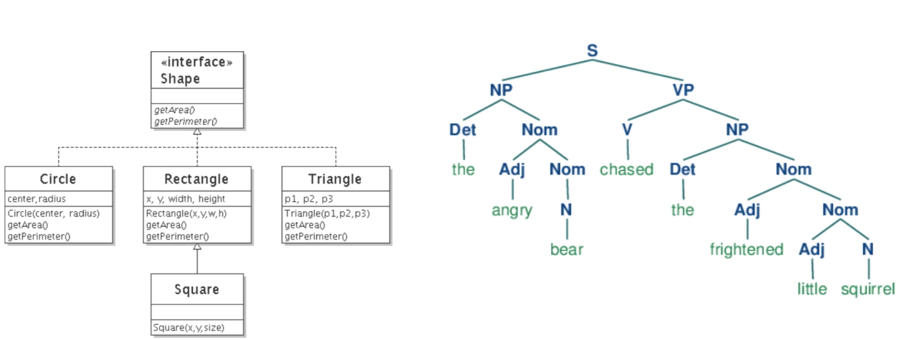
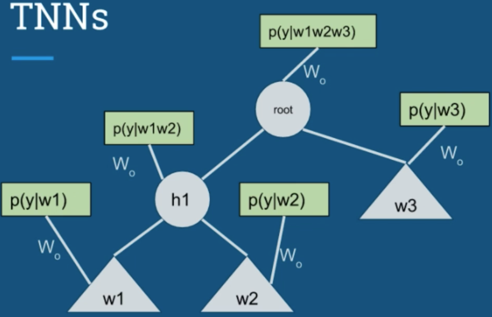

<!-- TOC -->

- [Description](#description)
- [Working with Word Vectors](#working-with-word-vectors)
  - [Word Embeddings](#word-embeddings)
    - [Word Analogies](#word-analogies)
- [Review of Language Modeling and Neural Networks](#review-of-language-modeling-and-neural-networks)
  - [Bigrams and Language Models](#bigrams-and-language-models)
  - [Neural Bigram Model](#neural-bigram-model)
  - [Neural Network Bigram Model](#neural-network-bigram-model)
  - [Improving Efficiency](#improving-efficiency)
  - [Review & Summary](#review--summary)
- [Word Embeddings using Word2Vec](#word-embeddings-using-word2vec)
  - [CBOW -- Continuous Bag of Words](#cbow----continuous-bag-of-words)
  - [Skip-Gram](#skip-gram)
    - [Introduction](#introduction)
    - [Hierarchicha Softmax](#hierarchicha-softmax)
    - [Negative sampling](#negative-sampling)
  - [Word2Vec Implementation Tricks](#word2vec-implementation-tricks)
    - [Code implementation](#code-implementation)
- [Word Embeddings using GloVe](#word-embeddings-using-glove)
  - [Matrix Factorization for Recommender System](#matrix-factorization-for-recommender-system)
  - [Matrix Factorization Training](#matrix-factorization-training)
    - [Minimize the loss](#minimize-the-loss)
    - [Adding Bias Terms](#adding-bias-terms)
    - [Regularization in MF](#regularization-in-mf)
  - [GolVe implementation](#golve-implementation)
    - [Code implementation](#code-implementation-1)
- [Unifying Word2Vec and GloVe](#unifying-word2vec-and-glove)
  - [Pointwise Mutual Information -- Word2Vec as Matrix Factorization](#pointwise-mutual-information----word2vec-as-matrix-factorization)
- [Use NN to Solve NLP Problems](#use-nn-to-solve-nlp-problems)
  - [Parts-of-Speech(POS) Tagging](#parts-of-speechpos-tagging)
    - [Code implementation](#code-implementation-2)
  - [Name Entity Recognition (NER)](#name-entity-recognition-ner)
    - [Code implementation](#code-implementation-3)
- [Recursive Neural Network (Tree Neural Network)](#recursive-neural-network-tree-neural-network)
  - [TNN Introduction](#tnn-introduction)
  - [Data Representation for TNN](#data-representation-for-tnn)
  - [What are TNN and How to Build TNN](#what-are-tnn-and-how-to-build-tnn)
    - [Build a TNN](#build-a-tnn)

<!-- /TOC -->


## Description
This folder is mainly for holding notebooks and .py files for learning NLP with Deep Learning.

This folder will cover **4 new architectures** used in NLP.

**(1) To begin with, you will learn how `word2vec` works, from theory to implementation**.

`Word2vec` is interesting because it magically maps words to a vector space where you can **find analogies**, like:

- king - man = queen - woman
- France - Paris = England - London
- December - Novemeber = July - June

For those beginners who find algorithms tough and just want to use a library, we will demonstrate the use of the `Gensim` library to obtain **pre-trained word vectors**, compute similarities and analogies, and apply those word vectors to build text classifiers. You will also learn how to build a word2vec model by using the `Spacy` library

**(2) Then we will focus on the `GloVe` method**, which also finds word vectors, but uses a technique called **matrix factorization**, which is a popular algorithm for recommender systems.

Amazingly, the word vectors produced by GLoVe are **just as good as** the ones produced by word2vec, and it’s **much easier** to train.

We will also look at some **classical NLP problems**, like **parts-of-speech tagging** and **named entity recognition**, and **(3) use `recurrent neural networks`** to solve them. You’ll see that any problem can be solved using neural networks, but you’ll also learn **the dangers of having too much complexity**.

**(4) Lastly, you’ll learn about `recursive neural networks`**, which finally help us solve the problem of **negation in sentiment analysis**. Recursive neural networks exploit the fact that sentences have a tree structure, and we can finally get away from naively using bag-of-words.

<br>

**What you’ll learn**
- Understand and implement `word2vec`
- Understand the `CBOW` method in `word2vec`
- Understand the `skip-gram` method in `word2vec`
- Understand the `negative sampling optimization` in `word2vec`
- Understand and implement `GloVe` using `gradient descent` and `alternating least squares`
- Use `recurrent neural networks` for `parts-of-speech tagging`
- Use `recurrent neural networks` for `named entity recognition`
- Understand and implement `recursive neural networks` for sentiment analysis
- Use `Gensim` to obtain pretrained word vectors and compute similarities and analogies

<br>


## Working with Word Vectors
### Word Embeddings
In general ML problem, we have a matrix of N x D, each row is a sample, it's a vector of D dimensional, which means each sample could be **reprensented** by such a vector

Word embeddings is just a fancy way to express how a word is represented by a vector. Suppose we have V words, and each word is represented by a vector of length D, then we have a matrix of shape V x D, this matrix is also known as word embeddings, word vectors

So how do we "embedding" a categorical entity (word) into a vector space? We can talk about this later, first, let's see how can we use word embeddings to solve problems.

#### Word Analogies
king - man ~= queen - women
walking - walked = swimming - swam


**How to find analogies?**
- There are 4 words in every analigy
- Input: 3 words
- Output: find the 4th word
- e.g.: 
  - King - man = ? - Woman
  - King - Man + Women = ?
  - **key point: use vector distance to find the closest matching word**

<br>

**Pretrained wordvectors**
[pretrained_glove.py](pretrained_glove.py)

[pretrained_w2v.py](pretrained_w2v.py)

<br>

**Text classification**
Bag-of-words
- How can we go from word2vec/glove vectors to bag-of-words
- e.g.
  - `I like eggs`
  - feature vector = [vec("I") + vec("like") + vec("eggs")] / 3
  - $feature = \frac{1}{|sentence|} \sum_{w \in sentence} vec(w)$

[bow_classifier.py](bow_classifier.py)

<br>

## Review of Language Modeling and Neural Networks
### Bigrams and Language Models
**language model**
- language model: a model of the proabability of a sequence of words
- it allows us to calculate: `p(the quick brown fox jumps over the lazy dog)`
- it involves some assumptions about language

**bigram**
- bi = 2, `bigram`: 2 consecutive words in a sentence
- e.g. for sentence `the quick brown fox jumps over the lazy dog`
- bigrams:
  - `the quick`
  - `quick brown`
  - `brown fox`
- we can also have `trigram` and `N-gram`

**Bigram Model**
- $p(w_t|w_{t-1}) = ?$
- e.g. $p(brown|quick) = 0.5, p(the|the) = 0$
- question is how do we find these probabilities?
  $$p(brown|quick) = \frac{count(quick \rightarrow brown)}{count(quick)}$$

**Back to language model**
- How do bigrams help us represent the probability of a senteence?
- Let's start by making some assumptions:
  - Suppose we have a sentence(sequence of words) `A B C`, we want to get p(A--> B --> C)
  - Using `Bayes Rule` and chain rule of probability:
    - $p(A \rightarrow B \rightarrow C) = p(C|A \rightarrow B)p(B|A)p(A)$
    - Notice: $p(B|A)$ is **bigram**!
  - **Unigram**:
    - $p(A) = \frac{count(A)}{corpus\ length}$
  - **Trigram**:
    -  $p(C|A, B) = \frac{count(A \rightarrow B \rightarrow C)}{count(A \rightarrow B)}$
- As you could notice, the longer the sentence is, the longer the chain probability is, **but there is a problem**:
  - Consider `p(dog|the quick brown fox jumps over the lazy)`
  - `the quick brown fox jumps over the lazy dog` is probably the only sentence like this in our corpus
  - we know `the quick brown fox jumps over the lazy turtle` is a valid and reasonable sentence
  - HOWEVER, we may find by counting that `p(turtle|the quick brown fox jumps over the lazy)` = 0, which doesn't make sense, and our language model shoulld allow for it!
- One way to solve this problem is called **Add-one smoothing**

**Add-one smoothing**
- Instead of maximum-likelihood counting, we add a small number to each count
- `V = vocabulary size = number of distinct words`, divided by V in denominator to ensure probabilities sum to 1
  $$p_{smooth}(B|A) = \frac{count(A \rightarrow B) + 1}{count(A) + V}$$

**Markov Assumption**
- This is another modifcation we can make
- "What I see now depends only on waht I saw in the previous step" -- **2nd order Markov Assumption**:
$$p(w_t|w_{t-1}, w_{t-2}, ..., w_1) = p(w_t|w_{t-1})$$
- For a model with only bigrams:
  $$p(A,B,C,D,E) = p(E|D)p(D|C)p(C|B)p(B|A)p(A)$$

<br>

[bigram code](markov.py)

<br>

### Neural Bigram Model
A neural model for biagram
- Instead of counting, let's use a neural to model $p(w_t|w_{t-1})$
- recall: neuron = logistic regression, $logit = w^Tx$

One-hot encoding of words

**How can we use logistic regression to train a bigram mdoel?**
- First, we need to use One-hot encoding to encode each word
- If `x = last word`, `y = current word`, then this is exactly a bigram!
  $$p(y|x) = softmax(W^Tx)$$
- In general, X is an N x D matrix of input samples, Y is an N x K matrix of output targets
- D = #input features, K = #output classes
- In our case, D = V, K = V (`V = vocabulary size`)

**An interesting comparison**
- **Note**: W in this section and bigram_probs in the last section are both V x V matrices, are they somehow related?
  - If we take the `softmax(W)`, we get `p(current | last)`
  - We can also do the opposite opperation: `log(bigram_probs)`
  - You can try replacing W in logistic regression with  `log(bigram_probs)` and calculate the cross-entropy -- **plot it as a constant with the training loss of logistic regression** 

[code for comparing logistic and bigram](logistic.py)

<br>

### Neural Network Bigram Model
- Previously, we saw how logistic regression weights W are equivalent to bigram probabilities derived from counting
- This section, we will extend the idea further by building a neural network, and **you will see later how `word2vec` is developed based on this idea!**
- Previously:
  $$p(y|x) = softmax(W^Tx)$$
- Now:
  $$\begin{aligned}
  h &= tanh(W_1Ttx) \\
  p(y|x) &= softmax(W_2^Th)
  \end{aligned}
  $$

**Hyper-parameters of NN:**
- Because the model we are going to build is a single hidden layer NN, a crucial hyper-parameter we need to consider is **number of neurons** in the hidden layer, let's call it `D`
- Then:
  - shape(W1) = V x D
  - shape(W2) = D x V
- NOTE: D should be much smaller than V -- D << V

**Advantages of using Neural Network**
- If you run the code of the last section, you would find it's very slow to train the logistic regression model even by setting `epoch=1`
- It might be intuitive to assume that a linear model would train faster than NN given that it's more simpler than NN. **HOWEVER, this is wrong!**
- Suppose V = 10,000, for logistic regression:
  - W contains V x V = 100 million
- Suppose D = 100, for NN:
  - W1 and W2 contain 10^2 x 10^4 = 10^6 each, 2 million in total
- We get 50:1 compression ratio using NN compared to logistic regression
- In addition, less params means less chance of overfitting! 

Bigram probabilities
- Matrix multiplication: (V x D)(D x V) -- V x V
- Logistic regression: $p(y|x) = softmax(W^Tx)$
- NN: $p(y|x) = softmax(W_2^T tanh(W_1^Tx))$, $\hat W = tanh(W_1)W_2$

<br>

[code for training bigram using NN](neural_network.py)

<br>

### Improving Efficiency
- In the last section, we saw how we can improve the training efficiency by changing logistic regression to NN
- In this section, **you can do even faster** by using some **Numpy indexing tricks**, and these tricks will be used as we move forward, so pay attention!

**Ineficiency**
- Notice that for every sentence we encouter, we need to create a one-hot representation of it
  - e.g. for a sentence of length N, we generate 2 matrices of size N x V!
- Now, suppose the index of a input word is k
- Then, one-hot vector contains all 0s and **1 at index k**
- In fact, multiplying the one-hot vector by the weight matrix is the same as **selecting the kth row of the weight matrix**
  
  - Old way:
  ```python
  one_hot = get_one_hot(k)
  one_hot.dot(W)
  ```
  - New way:
  ```python
  W[k]
  ```
- Notice that, using new way, we save the space of creating one_hot!
- So for a sentence of length N containing word indices, we can use that directly instead of creating an N x V one-hot matrix
- If V = 10,000, we get a savings of 10,000x !

**Apply the indexing trick as much as possible in our code:**
- **For predictions:**
  ```python
  hidden = np.tanh(W1[inputs])
  predictions = softmax(hidden.dot(W2))
  ```
- **For loss calculation:**
  - $J = \frac{1}{N} \sum_{n=1}^N \sum_{k=1}^V y_{n,k} log(p(y_{n,k}|X_n))$
  - Old way:
    ```python
    # predicitions shape: n x V
    one_hot_targets * np.log(predicitions)
    ```
  - New way:
    ```python
    np.log(predictions[np.arange(n - 1), targets]
    ```
- **For gradient updates:**
  - If we have 1 input word, only the weights from the kth row of W1 will affect the hidden layer, **but all weights in W2 will affect the output**
  - **Keep in mind**: Only the weights that contribute to the error need to be updated
  - **Updating W2:**
    - We have a problem!
    - Previsouly, the update was:
    ```python
    W2 = W2 - lr * hidden.T.dot(predictions - targets)
    ```
    - Now we can no longer subtract the targets because targets is no longer N x V, it's just an index array!
    - In fact, we can **use double indexing trick** again:
    ```python
    doutput = predictions
    doutput[np.arange(n - 1), targets] -= 1
    W2 = W2 - lr * hidden.T.dot(doutput)
    ```
  - **Updating W1:**
    - This part is hardest
    - Reall: we only need to update the part of W1 that corresponds to the input word!
    - Problem: we have multiple input words, and **the same word may appear twice!**
      - inputs might select the same row of W more than once -- **behavior undefined!**
      - **Please check code for the solution**


**Pay attention to how to implement `gradient update` part in the code below**

[efficient code using numpy index trick](neural_network_2.py)

<br>

### Review & Summary
- For the language modeling with bigrams, we use two ways to get the probability estimation:
  - (1) counting relative frequencies of words and word pairs
  - (2) use Neural representation
    - logistic regression
    - simple neural network
  - Interesting perspective: all the three ways are just function approximation for $p(w_t|w_{t-1})$
  $$\begin{aligned}
  \hat{p(y|x)} &= \frac{count(x \rightarrow y)}{count(x)} \\
  \hat{p(y|x)} &= softmax(W^Tx)\\
  \hat{p(y|x)} &= softmax(W_2^T tanh(W_1^Tx))
  \end{aligned}
  $$

<br>


## Word Embeddings using Word2Vec
- In the last section, we've already seen how to implement a `neural bigram` model to get a **V x D embedding matrix**
- In this section, you will find out `Word2Vec` is nothing but an extension of the `neural bigram` model with better embeddings!
  
### CBOW -- Continuous Bag of Words

- Note: we won't implement this in code, because we will explore similar method that works better -- `Skip-Gram`
- Framework of CBOW:
  - step 1: find the mean of input word vectors
  $$h = \frac{1}{|C|} \sum_{c \in C} W^{(1)}_c$$
  - step 2: get the output prediction
  $$p(y|C) = softmax(W^{(2)T}h)$$
  - **Note: no hidden activation function!**

<br>

### Skip-Gram
#### Introduction

- Two different ways of thinking of input-output relationship:
  - (1) 1 input with 4 targets/ouyputs
    - 4 softmaxes, 4 predictions
    - 4 errors summed to get total error
  - (2) 4 separate samples of just word-pairs
    - each input has 1 softmax, 1 prediction

- Framework:
  $$\begin{aligned}
    h &= W^{(1)}_{input} \\
    p(y|input) &= softmax(W^{(2)T}h)
  \end{aligned}
  $$

<br>

**Problems of the framework**

<br>

#### Hierarchicha Softmax


<br>

#### Negative sampling
**Let's do some recap about Multiclass and Binary classification first:**
- **Binary**:
  - $$p(y_{out}=1 | x_{in}) = \sigma(W^{(1)}_{in} W^{(2)}_{out})$$
  - $$J = - ( y_{out}log(p(y_{out}=1 | x_{in})) + (1 - y_{out})log(1 - p(y_{out}=1 | x_{in})) )$$
- **Multiclass**:
  - $$p(y_{out} | x_{in}) = \frac{exp(W^{(1)}_{in} W^{(2)}_{out})}{\sum_{j=1}^V exp(W^{(1)}_{in}W^{(2)}_{j})}$$
  - $$J = - y_{out}log(y_{out} | x_{in})$$

**What negative sampling does is:**
- Instead of doing multiclass cross-entropy, just do binary cross-entropy on the **negative samples**
- Example: The quick <font color=blue> brown fox</font> <font color=green>jumps</font> <font color=blue>over the</font> lazy dog
  - Input/Center word: <font color=green>jumps</font>
  - Target/Context words: <font color=blue>brown, fox, over, the</font>
  - Negative samples: <font color=red>apple, orange, boat, tokyo</font>
  $$\begin{aligned}
    p(brown|jumps) &= \sigma(W^{(1)}_{jumps} W^{(2)}_{brown}) \\
    p(fox|jumps) &= \sigma(W^{(1)}_{jumps} W^{(2)}_{fox}) \\
    p(over|jumps) &= \sigma(W^{(1)}_{jumps} W^{(2)}_{over}) \\
    p(the|jumps) &= \sigma(W^{(1)}_{jumps} W^{(2)}_{the}) \\
    p(apple|jumps) &= \sigma(W^{(1)}_{jumps} W^{(2)}_{apple}) \\
    p(orange|jumps) &= \sigma(W^{(1)}_{jumps} W^{(2)}_{orange}) \\
    p(boat|jumps) &= \sigma(W^{(1)}_{jumps} W^{(2)}_{boat}) \\
    p(tokyo|jumps) &= \sigma(W^{(1)}_{jumps} W^{(2)}_{tokyo})
  \end{aligned}
  $$

  $$J = - \left[ log(p(brown|jumps)) + log(p(fox|jumps)) + log(p(over|jumps)) + log(p(the|jumps)) + log(1 - p(apple|jumps)) + log(1 - p(apple|jumps)) + log(1 - p(orange|jumps)) + log(1 - p(boat|jumps)) + log(1 - p(tokyo|jumps)) \right]$$

- **The objective function in general**:
  - C = set of context words
  - N = set of negative words
  $$J = - \left( \sum_{c \in C} log(\sigma(W^{(1)}_{in} W^{(2)}_{c})) + \sum_{n \in N} log(1 - \sigma(W^{(1)}_{in} W^{(2)}_{n})) \right)$$
  - Recall: 
    - $p(y=1|x) = \sigma(logit)$
    - $p(y=0|x) = \sigma(-logit)$
    - $\sigma(logit) + \sigma(-logit) = 1$
  $$J = - \left( \sum_{c \in C} log(\sigma(W^{(1)}_{in} W^{(2)}_{c})) + \sum_{n \in N} log(\sigma(- W^{(1)}_{in} W^{(2)}_{n})) \right)$$
  - We want to **maxmize** $W^{(1)}_{in} W^{(2)}_{c}$ while **minimize** $W^{(1)}_{in} W^{(2)}_{n}$

<br>

**Important details about negative sampling:**
- (1) How many negative samples should we choose?
  - 5 ~ 10,, even as high as 25
  - (Remember, with **true softmax**, there would be (V - 1) negative samples, and V could be a large number, like 3,000,000)
- (2) How to choose negative samples?
  - Uniform distribution? Wrong!
  $$p(w) = \frac{count(w)}{\sum_{i=1}^n count(w_i)}$$
  - We actually use **modified uniform distribution**:
  $$\tilde p(w) = \frac{count(w)^{0.75}}{\sum_{i=1}^n count(w_i)^{0.75}}$$
  - By doing this, we can make the probability of sampling rare words larger while reducing the probability of sampling frequent words
- (3) Another trick in implementation is that: instead of sampling the context words, **we prefer to sample the center words**
  - e.g. The quick <font color=blue> brown fox</font> <font color=green>jumps</font> <font color=blue>over the</font> lazy dog
  - In implementation, when we do negative sampling, we actually replace the `jumps` with another randomly sampled word, say `lighthouse`:
    - The quick <font color=blue> brown fox</font> <font color=green>lighthouse</font> <font color=blue>over the</font> lazy dog

<br>

One thing you might notice is that, under the **Skip-Gram **framework, we actually **get 2 embeddings -- W1, W2**, so which one would we choose? There are 3 options:
- (1) $W_e = W_1$
- (2) $W_e = concat([W_1, W_2])$, now shape is V x 2D
- (3) $W_e = (W_1 + W_2^T) / 2$

Also, please note: sometimes, people also tend to normalzie the word vectors: 
$$\hat{v} = \frac{v}{|v|}$$

<br>

### Word2Vec Implementation Tricks
**How to choose words to train on?**
- Words frequencies follow a fat-tailed distribution (Zipf's Law)
- We need to drop some words before training
  $$p_{drop}(w) = 1 - \sqrt{\frac{threshold}{\tilde{p}(w)}}$$
  - Typical $threshold = 10^{-5}$
  - e.g. 
    - if $p(w) = 10^{-5}$, then $p_{drop}(w) = 1 - 1 = 0$, which means no chance to drop this word
    - if $p(w) = 0.1$, then $p_{drop}(w) = 1 - 10^{-2} = 0.99$, which means, this word is very likely to be dropped
- In addition to the effect of keeping some rare words, this method also **effectively widens the context window** given that some frequent words would be dropped!

**Learning rate scheduling**
- Linearly decrease learning rate from max --> min, which is similar to what we normally do when training a neural network

**Use multi-thread to train the model**
<br>

#### Code implementation
[Word2Vec Code in numpy](word2vec_numpy.py)

Note: 
- it takes a very long time to run the above code if you use `wiki` data instead of `brown` data
- feel free to sample the data to test the model too.

**Extra implementation in TF**

In fact, we can also use tensorflow to train a word2vec model, the only difference is that we no longer use the self-defined SGD function, instead we use TF's **automatic differentiation**

[Word2Vec Code in TensorFlow](word2vec_tf.py)

<br>

## Word Embeddings using GloVe
**GloVe: Global Vectors for Word Representation**

Before we talk about the `GloVe`, let's dive into how **`Matrix Factorization` is used in Recommender System**, then you will find out how the same approaches can be applied in NLP with a little modifications/improvements, i.e. `GloVe`

### Matrix Factorization for Recommender System

**Collaborative Filtering**
- `Matrix Factorization (MF)` falls into a class of algorithms called `collaborative filtering`
- It's **collaborative** because we use other users' data to help make predictions for you

There are some similarities between user rating matrix and NLP doc-word matrix:
- Each `user` is the row, while each `movie` is the column; two users are similar if they have similar rating value for the same movie
- Each `word` is the row, while each `doc` is the column; two words are similar if they appear in the same docs many times
- **Key properties** of the above two matrix is: **redundancy**!
  - In ML, 2 features are redundant if they are correlated with eavh other, in another words, we can predict one from the other
  - It's easy to see that Both docs and movie ratings are reduant!
  
**How do we exploit redundancy?**
- We want to reduce the dimensionality of the data
- One way to do dimension reduction is **SVD**
  $$X = USV^T$$
  - X: (N, D)
  - U: (D, D)
  - S: (D, D)
- In order to to do dimension reduction, we have to do some approximation:
  $$\hat{X} = USV^T$$
  - **K << D**
  - X: (N, K)
  - U: (K, D)
  - S: (D, D)
- **NOTE: Here, we won't cover details about SVD**, because:
  - We simply use SVD as comparison/intuition of the latter approches, SVD let us know we it's possible to factorize a matrix!
  - SVD doesn't work for recommender system as:
    - rating matrix has missing values
    - usual implementations (e.g. `sklearn`) won't scale to large matrix
- **What we really want matrix factorization** is in the format:
  $$R \approx \hat{R} = WU^T$$
  - By doing matrix factorization, our prediction matrix $\hat{R}$ has **no missing values!**
  - Each individual prediction is just **a simple dot product of 2 K-length vectors**
  $$\hat{r_{ij}} = W_{i}^TU_{j}$$
  - Note: recommendations would be movies we haven't seen yet, sorted by their rating predictions!
  
**Model Evaluation**
- Since it's a regression problem, we use the `squared error` only for the ratings that are known:
  $$J = \sum_{i,j \in \Omega} (r_{ij} - \hat{r_{ij}})^2$$, $Omega$ = set of all paris (i,j) where user i rated movie j
- Analogous to SVD cost:
  $$J = \sum_{i=1}^{N} \sum_{j=1}^{D} (X_{ij} - \hat{X_{ij}})^2$$
- Let's introduce two more symbols for later use:
  - $\Omega_{j}$ = **set of users** i who rated movie j
  - $\Psi_{i}$ = **set of movies j** where user i rated

<br>

### Matrix Factorization Training
#### Minimize the loss
**Solve for W**
$$J = \sum_{i,j \in \Omega} (r_{ij} - \hat{r_{ij}})^2 = \sum_{i,j \in \Omega} (r_{ij} - w_{i}^T u_{j})^2$$
- Careful about which sets are being summed over
- For a particular user vector $w_i$, we only care about movies that user rated (because only those ratings involve $w_i$)
  $$\begin{aligned}
     \frac{\partial{J}}{\partial{w_i}} = 2 \sum_{j \in \Psi_i}(r_{ij} - w_{i}^T u_{j})(-u_j) = 0 \\
     \left( \sum_{j \in \Psi_i} u_ju_j^T \right) w_i = \sum_{j \in \Psi_i} r_{ij}u_j \\
     w_i = \left( \sum_{j \in \Psi_i} u_ju_j^T \right)^{-1} \sum_{j \in \Psi_i} r_{ij}u_j 
  \end{aligned}
  $$
- Now, it's just AX = b, which we can solve by using `x = np;linalg.solve(A, b)`

**Solve for U**
- Loss is **symmetric** in W and U, so the steps should be the same
- Be carefule about which set to sum over
  $$J = \sum_{i,j \in \Omega} (r_{ij} - \hat{r_{ij}})^2 = \sum_{i,j \in \Omega} (r_{ij} - w_{i}^T u_{j})^2$$
- For a particular movie vector $u_j$, we only care about users who rated this movie
  $$\begin{aligned}
     \frac{\partial{J}}{\partial{u_j}} = 2 \sum_{i \in \Omega_j}(r_{ij} - w_{i}^T u_{j})(-w_i) = 0 \\
     \left( \sum_{i \in \Omega_j} w_iw_i^T \right) u_j = \sum_{i \in \Omega_j} r_{ij}w_i \\
     u_j = \left( \sum_{i \in \Omega_j} w_iw_i^T \right)^{-1} \sum_{i \in \Omega_j} r_{ij}w_i 
  \end{aligned}
  $$
- You may notice that solutions for W depends on U, solutions for U depends on W, which means you will need to apply the two following equations iteratively:
  $$\begin{aligned}
    w_i &= \left( \sum_{j \in \Psi_i} u_ju_j^T \right)^{-1} \sum_{j \in \Psi_i} r_{ij}u_j \\
    u_j &= \left( \sum_{i \in \Omega_j} w_iw_i^T \right)^{-1} \sum_{i \in \Omega_j} r_{ij}w_i 
  \end{aligned}
  $$
- This approach is called **`Alternating Least Squares (ASL)`**
  - Does it matter which order you update in? NO!
  - Should we use the old values of W when updating U, and vice versa?
    - **It would be faster if we use the new values**, so always use the newest value for W or U
<br>

#### Adding Bias Terms
**Why we need bias terms?**
- Different people rate things differently, which is called `user bias`:
  - Optimistic users: they rate everthing high, if average rating is 4.5, 3.5 means bad for those users 
  - Pessimistic users: they rate everthing low, if average rating is 2.5, 3.5 means great for those users 
- Similar standard could be applied to movie, so we also have `movie bias`
- Hence, it makes sense to add bias terms to the MF model
  $$\begin{aligned}
    \hat{r_{ij}} &= w_i^T u_j + b_i + c_j + \mu \\
    b_i &= user\ bias \\
    c_j &= movie\ bias \\
    \mu &= global\ average 
  \end{aligned}
  $$
- **Objective function and prediction**
  $$\begin{aligned}
    J &= \sum_{i,j \in \Omega} (r_{ij} - \hat{r_{ij}})^2 = \sum_{i,j \in \Omega} (r_{ij} - w_{i}^T u_{j})^2 \\
    \hat{r_{ij}} &= w_i^T u_j + b_i + c_j + \mu \\
  \end{aligned}
  $$

- **Solving for W**
  $$\begin{aligned}
    \frac{\partial{J}}{\partial{w_i}} &= 0 \Rightarrow 
    w_i = \left( \sum_{j \in \Psi_i} u_ju_j^T \right)^{-1} \sum_{j \in \Psi_i} (r_{ij} - b_i - c_j - \mu) u_j \\
  \end{aligned}
  $$
- **Solving for U**
  $$\begin{aligned}
    \frac{\partial{J}}{\partial{u_j}} &= 0 \Rightarrow 
    u_j = \left( \sum_{i \in \Omega_j} w_iw_i^T \right)^{-1} \sum_{i \in \Omega_j} (r_{ij} - b_i - c_j - \mu) w_i \\
  \end{aligned}
  $$
- **Solving for b**
  $$\begin{aligned}
    \frac{\partial{J}}{\partial{b_i}} &= 0 \Rightarrow 
    b_i = \frac{1}{|\Psi_i|} \sum_{j \in \Psi_i} (r_{ij} - w_i^T u_j - c_j - \mu) \\
  \end{aligned}
  $$
  - $b_i$ is the average deviation between target and modeling prediction, if the prediction did not involve $b_i$
  - in another words, $b_i$ is exactly how much you need to add to the model prediction for the specific user i
- **Solving for c**
  $$\begin{aligned}
    \frac{\partial{J}}{\partial{c_j}} &= 0 \Rightarrow 
    c_j = \frac{1}{|\Omega_j|} \sum_{i \in \Omega_j} (r_{ij} - w_i^T u_j - b_i - \mu) 
  \end{aligned}
  $$
  - $b_i$ is the average deviation between target and modeling prediction, if the prediction did not involve $b_i$
  - in another words, $b_i$ is exactly how much you need to add to the model prediction for the specific user i
- For the gloabal average $\mu$, we can just calculate it directly from training data

**In summary:**
$$\begin{aligned}
  w_i &= \left( \sum_{j \in \Psi_i} u_ju_j^T \right)^{-1} \sum_{j \in \Psi_i} (r_{ij} - b_i - c_j - \mu) u_j \\
  u_j &= \left( \sum_{i \in \Omega_j} w_iw_i^T \right)^{-1} \sum_{i \in \Omega_j} (r_{ij} - b_i - c_j - \mu) w_i \\
  b_i &= \frac{1}{|\Psi_i|} \sum_{j \in \Psi_i} (r_{ij} - w_i^T u_j - c_j - \mu) \\
  c_j &= \frac{1}{|\Omega_j|} \sum_{i \in \Omega_j} (r_{ij} - w_i^T u_j - b_i - \mu)
\end{aligned}
$$
<br>

#### Regularization in MF
$$J = \sum_{i,j \in \Omega} (r_{ij} - \hat{r_{ij}})^2 + \lambda(||W||_{F}^2 + ||U||_{}^2 + ||b||_{}^2 + ||c||_{}^2)$$
- $||*||_F$ is called the Frobenius norm
- Derivatives are additive, so just differentiate the 2nd term and add it to the existing derivative:
  - **Solving for W**
  $$\begin{aligned}
    \frac{\partial{J}}{\partial{w_i}} = 2 \sum_{j \in \Psi_i} (r_{ij} - w_i^Tu_j - b_i - c_j - \mu) (-u_j) + 2\lambda w_i = 0 \\
    w_i = \left( \sum_{j \in \Psi_i} u_ju_j^T + \lambda I \right)^{-1} \sum_{j \in \Psi_i} (r_{ij} - b_i - c_j - \mu) u_j 
  \end{aligned}
  $$
  - **Solving for U**
  $$\begin{aligned}
    u_j = \left( \sum_{i \in \Omega_j} w_iw_i^T + \lambda I \right)^{-1} \sum_{i \in \Omega_j} (r_{ij} - b_i - c_j - \mu) w_i
  \end{aligned}
  $$
  - **Solving for b**
  $$\begin{aligned}
    \frac{\partial{J}}{\partial{b_i}} &= 2 \sum_{j \in \Psi_i} (r_{ij} - w_i^Tu_j - b_i - c_j - \mu) (-1) + 2\lambda b_i = 0 \\
    \sum_{j \in \Psi_i} b_i + \lambda b_i &= \sum_{j \in \Psi_i} (r_{ij} - w_i^Tu_j - c_j - \mu)\\
    b_i &= \frac{1}{|\Psi_i| + \lambda} \sum_{j \in \Psi_i} (r_{ij} - w_i^T u_j - c_j - \mu)
  \end{aligned}
  $$
  - **Solving for c**
  $$\begin{aligned}
    c_j &= \frac{1}{|\Omega_j| + \lambda} \sum_{i \in \Omega_j} (r_{ij} - w_i^T u_j - b_i - \mu)
  \end{aligned}
  $$

<br>

### GolVe implementation
- For `GloVe`, we will not build a word-doc matrix, like `bag-of-words`, `tf-idf`, instead, we will build a **word-word matrix -- X(i, j)**
- **Context distance**:
  - e.g. `"I love dogs and cats"`
  - X(I, love) += 1
  - X(I, dogs) += 1/2
  - X(I, and) += 1/3
  - ... up to a certain context size, like 5
  - There are many 0s -- sparse matrix
  - **NOTE**: recommender system also give us a sparse matrix, **but `GloVe` values are not missing!**
- **Long-tail distribution** --> non-zero values will be very large
  - So we take the log
  - **log(X(i, j))** will be the target
  - **Add 1** before taking the log so that we don't have NaNs!
- **Weight every (i, j) in the matrix**
  - $f(x_{ij}) = (\frac{x_{ij}}{x_{max}})^{\alpha}, if\ x_{ij} < x_{max},\ else\ 1$
  - $\alpha = 0.75,\ x_{max} = 100$
- **Loss function**: 
  $$J = \sum_i \sum_j f(x_{ij})(log(x_{ij} + 1) - w_i^T u_j)^2$$

**How to train the model?**
- Original papaer use `gradient descent`, in our code, we will do both `gradient descent` and `alternating least squares`
- Original paper use two bias terms, we will use 3 bias terms:
  $$log(x_{ij}) \approx w_i^T u_j + b_i +c_j + \mu$$
- **NOTE**: training time **doesn't depend on the amount of data**, because you are always fitting a (V, V) matrix (only the creation of X will take longer)
- params update formula:
  $$\begin{aligned}
    w_i &= \left( \sum_j f(x_{ij}) u_ju_j^T \right)^{-1} \sum_j f(x_{ij})(log(x_{ij}) - b_i - c_j - \mu) u_j \\
    u_j &= \left( \sum_i f(x_{ij}) w_iw_i^T \right)^{-1} \sum_i f(x_{ij})(log(x_{ij}) - b_i - c_j - \mu) w_i \\
    b_i &= \frac{1}{\sum_j f(x_{ij})} \sum_j f(x_{ij})(log(x_{ij}) - w_i^T u_j - c_j - \mu) \\
    c_j &= \frac{1}{\sum_i f(x_{ij})} \sum_i f(x_{ij})(log(x_{ij}) - w_i^T u_j - b_i - \mu)
  \end{aligned}
  $$

<br>

#### Code implementation
- numpy implementation: [glove_numpy.py](glove_numpy.py)
- TF implementation using automatic differentiation: [glove_tf.py](glove_tf.py)
- Training GloVe using SVD: [glove_svd.py](glove_svd.py)


<br>

## Unifying Word2Vec and GloVe
### Pointwise Mutual Information -- Word2Vec as Matrix Factorization
[Neural Word Embedding as Implicit Matrix Factorization](http://papers.nips.cc/paper/5477-neural-word-embedding-as-implicit-matrix-factorization.pdf)
- Neural Word Embedding: word2vec
- Matrix Factorization: Glove

- **Glove**:
$$A_{ij} = log(X_{ij}) \approx w_i^Tu_j$$
- Goal: show how word2vec equations can be manipulated into the same format
- **Word2Vec objective**:
$$J = \sum_{w \in W}\sum_{c \in W} count(w,c)\{ log(\sigma(\vec{w}^T \vec{c})) + kE_{n \sim p(n)}[log(\sigma(-\vec{w}^T \vec{n}))] \}$$
  - W = set fo all words in the vocab
  - w = input word, $\vec{w}$ = input word vector
  - c = context word, $\vec{c}$ = context word vector
  - n = negative sample, $\vec{n}$ = negative sample word vector
  - p(n) = unigram distribution
  - k = number of negative samples drawn
$$\begin{aligned}
  E_{n \sim p(n)}[log(\sigma(-\vec{w}^T \vec{n}))] &= \sum_{n \in W} \frac{count(n)}{|\Omega|} log(\sigma(-\vec{w}^T \vec{n})) \\
  &= \frac{count(c)}{|\Omega|} log(\sigma(-\vec{w}^T \vec{c})) + \sum_{n \in W-\{c\}} \frac{count(n)}{|\Omega|} log(\sigma(-\vec{w}^T \vec{n})) \\
\end{aligned}
$$
- **local objective** for a single word-context pair (w,c)
$$J_{w,c} = \{ count(w,c)log(\sigma(\vec{w}^T \vec{c})) \} + \{ count(w)k\frac{count(c)}{|\Omega|}log(\sigma(-\vec{w}^T \vec{c})) \}$$
  - high-level: optimize the local objective $J_{w,c}$ w.r.t the $logit(\vec{w}^T \vec{c})$
  - let **$x = \vec{w}^T \vec{c}$**
  - optimize: $J_{w,c}$ w.r.t. x
  - solution: $\frac{\partial{J_{w,c}}}{\partial{x}} = 0$
- Take derivative and set to 0:
  $$\begin{aligned}
    \sigma(x) &= \frac{1}{1 + e^{-x}} = \frac{e^{x}}{1 + e^{x}}\\
    \sigma^{\prime}(x) &= \sigma(x)(1 - \sigma(x)) \\
    (log(\sigma(x)))^{\prime} &= \frac{1}{\sigma(x)} \sigma^{\prime}(x) = 1 - \sigma(x) = \sigma(-x) \\
    \frac{\partial{J_{w,c}}}{\partial{x}} &= count(w,c) \sigma(-x) - kcount(w)\frac{count(c)}{|\Omega|}\sigma(x) = 0 \\
  \end{aligned}
  $$
  - Simplify the above equation:
  $$e^{2x} - \left( \frac{count(w,c)|\Omega|}{kcount(w)count(c)}-1 \right)e^{x} - \frac{count(w,c)|\Omega|}{kcount(w)count(c)} = 0$$
  - Solve a quadratic equation (let $y = e^x$):
  $$y = \frac{count(w,c)|\Omega|}{kcount(w)count(c)}$$
  - plug back the original values $w^Tc$:
  $$w^Tc = log\left( \frac{count(w,c)}{count(w)} \frac{|\Omega|}{count(c)} \right) - log(k)$$
  - Notice, I seperate the term in a specific way -- ration of counts, because they represent probabilities
  - Shifted `Pointwise Mutual Information (PMI)`:
  $$PMI(x,y) = log\frac{P(x,y)}{p(x)p(y)}$$
  - Use the smoothed unigram distribution:
  $$w^Tc = log\left( \frac{count(w,c)}{count(w)} \frac{1}{\tilde{p}(c)} \right)$$
  - Similar to GloVe: the (w,c)th entry of the matrix is propotional to the log counts:
  $$w^Tc \propto log(count(w,c))$$

[code for PMI](pmi.py)

<br>

## Use NN to Solve NLP Problems
### Parts-of-Speech(POS) Tagging
- `POS` tag is a category you can assign a word, according to its **syntatic** function
- Detailed definition: link

**Baseline**
- `Logistic regression` as baseline
- One-hot encoding the words and tags, do softmax

**Sequences**
- Can we do better by using sequences/context?
- The answer is yes, we can use `RNN`
- Besides `RNN`, we can also try `HMM (Hidden Markov Model)`
  - Hidden states = POS tags, observed = words
  - We don't need `EM (Expectation Maximization)` to train, we know hidden states for this problem!
  - **HMM = Pi, A, B**
    - Pi = frequency of start tags
    - A = p(tag(t | tag(t-1)))
    - B = p(word(t) | tag(t))
    - **All can be calculated by just counting!**

**`Logistic regression`**
- sequence information was not captured
  $$p(tag|word) = softmax(W[word\_idx])$$
- it's limited, because it only maps word --> tag, and **one word can have multiple tags!**

**`RNN`**
$$h(t) = \sigma(W_{x}^T + W_{h}^T h(t-1) + b)$$
- `p(tag | "milk")` --> this is ambiguous
- `p(tag | "I just drank a glass of milk")` --> clearly a `noun`
- You can also plug in the advanced recurrent units, like `LSTM` and `GRU`
<br>

**`HMM`**
- `words` are observed
- `tags` are **hidden states**
- Why does this make sense?
  - we expect p() to be much higher (e.g. "John run") than p(verb | verb) (e.g. "walk kup")
  - A probability model of grammar


**How to use HMM to do POS tagging?**
- Step 1: Find the probabilities
  - for observations: `p(walk | verb)`
  - for markov state transitions: `p(verb | noun)`
  - **NOTE**: in the training phase, "hidden" states are not really hidden, we can just **calculate these probabilities with counting!**
- Step 2: Prediction, use `Viterbi algorithm` to map from a known sequence of words (`a sequence`) to an unknown sequence of hidden states (`POS tags`)

<br>

#### Code implementation
- [POS tagging using RNN in TensorFlow](pos_rnn_tf.py)
- [POS tagging using HMM](pos_hmm.py)

<br>

### Name Entity Recognition (NER)
- Similar to POS tagging: we want to tag each token in a sentence
- Named Entities: `person, company, location, etc`.
- Detailed definition: link
- **NER data is very imbalanced!** (~90% not an entity)
- Again, we will use logistic regression as basline, and then switch to RNN
<br>

#### Code implementation
- [NER using RNN in TensorFlow](ner_rnn_tf.py)
<br>


## Recursive Neural Network (Tree Neural Network)
### TNN Introduction


**Sentences as Trees**
Let's talk about `POS tags` first:
- Sentences are **hierachichal** in the view of `POS tags`:

- Sentiment Analysis:
  - `"This moview is great!"` -- Positive sentiment
  - `"This movie sucks"` -- Negative sentiment
  - In the diagram below, **`"but"`** negate the negative sentiment to positive
  
<br>

### Data Representation for TNN
- Previously, we've seen 2 ways of reprensenting sentences/text:
  - bag-of-words
  - sequence of words
- Now, we will try to use **parse trees** to represent sentences
- Here, we will create the parse trees based on the rules below:
  - It's a binary tree
  - All nodes with children must have 2 children
<br>

### What are TNN and How to Build TNN
- Recursiveness: we can define a node's balue by its children
  
- $x_1 = w_1$ = word embedding for $x_1$
- $h_1 = f(W_{left}x_1 + W_{right}x_2 + b)$
- $h_{root} = f(W_{left}h_1 + W_{right}x_3 + b)$
- What's the **dimensionality** og the weights?
  - A child can be a word $w_i$, or another hidden node $h_i$, so $W$ must fit with both, let's say `D`
  - So, $W$ is (D, D), $b$ is (D, ), $f()$ can be `relu`, `tanh`, etc
- How to get output?
  - Remember: any node can be labeled (we can choose whether or not to use them all for training):
    - $p(y|h) = softmax(W_oh + b_o)$
  
<br>

#### Build a TNN 
**Build TNN with Recursion**
<br>

**Trees to Sequences**


<br>
<br>
<br>
<br>